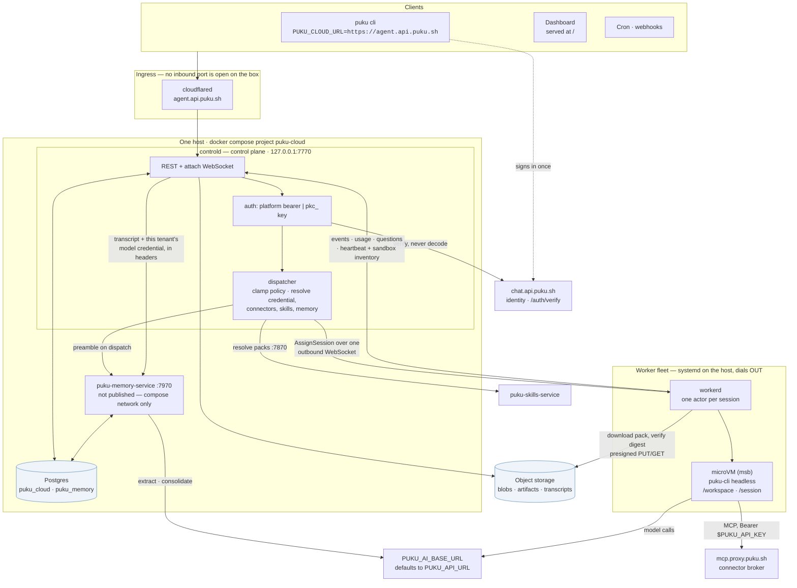
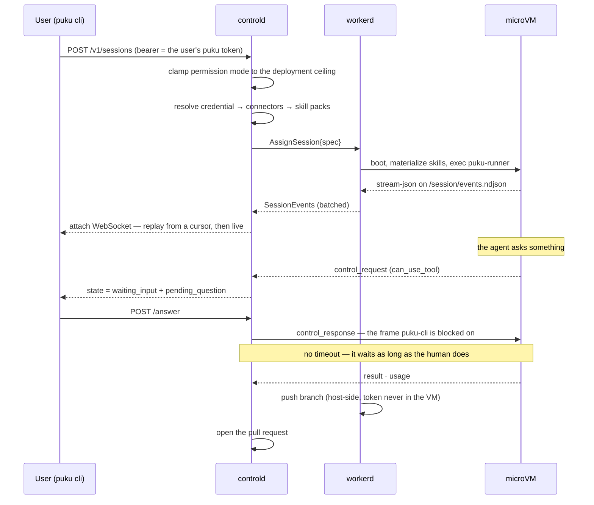

# puku-agent-cloud

Self-hosted agent cloud for **puku-cli**: each session runs headless inside a
hardware-isolated [microsandbox](https://github.com/superradcompany/microsandbox)
microVM on your own Linux/KVM servers and streams live back to the user's
terminal. Design doc: [`../AGENT-CLOUD-DESIGN.md`](../AGENT-CLOUD-DESIGN.md).


## Layout

| Path | What |
| --- | --- |
| `crates/puku-cloud-proto` | Shared wire types: event envelope, session state machine, worker frames, client WS protocol |
| `crates/puku-controld` | Control plane: REST API, client attach relay, worker WebSocket link, Postgres persistence |
| `crates/puku-workerd` | Per-host worker daemon; one microVM per session or machine, on libkrun (microsandbox SDK) and/or Cloud Hypervisor |
| `crates/puku-guestd` | Init and host agent inside Cloud Hypervisor guests (vsock: exec, ports, shutdown) |
| `crates/puku-cloud-cli` | `puku-cloud` client: `run / ls / attach / answer / input / interrupt / stop / resume / cancel` |
| `migrations/` | sqlx migrations (applied automatically by controld at startup) |
| `images/puku-agent/` | Guest OCI image + `puku-runner` in-guest supervisor |
| `deploy/` | compose for dev deps, systemd units, provisioning + msb prestage scripts |

## Documentation

| Doc | For |
| --- | --- |
| [`docs/DEPLOYMENT.md`](docs/DEPLOYMENT.md) | Standing the whole thing up on a bare-metal box, step by step, ending with a test sequence |
| [`docs/CLI-WALKTHROUGH.md`](docs/CLI-WALKTHROUGH.md) | Driving it from `puku cloud` — teleport, schedules, document runs |
| [`docs/API.md`](docs/API.md) | The control plane's HTTP API |
| [`docs/MACHINES-API.md`](docs/MACHINES-API.md) | Machines: generic VMs driven from outside (what puku-bot's computers run on) |
| [`docs/CLOUD-HYPERVISOR-PLAN.md`](docs/CLOUD-HYPERVISOR-PLAN.md) | The two-engine design (libkrun + Cloud Hypervisor), machines, and the puku-bot integration |
| [`../puku-skills-service/docs/API.md`](../puku-skills-service/docs/API.md) | The skill registry's HTTP API |
| [`docs/PUKU-CLI-CONTRACT.md`](docs/PUKU-CLI-CONTRACT.md) | The headless puku-cli contract, as measured against the real binary |
| [`docs/ARCHITECTURE.md`](docs/ARCHITECTURE.md) | Component diagrams: the platform, controld, the skills registry, and where telemetry goes |
| [`docs/SEQUENCE-FLOWS.md`](docs/SEQUENCE-FLOWS.md) | Sequence diagrams for each session flow |
| [`skills/deployment-test/`](skills/deployment-test/) | An agent skill that runs the test sequence for you |
| [`docs/SDK-MIGRATION-PLAN.md`](docs/SDK-MIGRATION-PLAN.md) | Driving the guest agent with `puku-agent-sdk` — compatibility findings, what is built, and the gate before it becomes the default |

## Quick start (dev, macOS Apple Silicon or Linux/KVM)

```sh
docker compose -f deploy/compose.dev.yml up -d postgres
cargo build --workspace

# control plane
PUKU_AI_API_KEY=... ./target/debug/puku-controld &

# worker (same or another machine)
PUKU_STATE_DIR=$HOME/.puku-cloud ./target/debug/puku-workerd &

# run a session
./target/debug/puku-cloud run "fix the failing test in ..." --repo https://github.com/you/repo
```

The guest image must exist first: `docker build -t puku-agent images/puku-agent`
(verify the puku-cli install line matches how puku-cli is actually
distributed), then push it somewhere the worker's registry access can reach
and set `PUKU_AGENT_IMAGE`.

### Stub smoke test (no puku-cli needed)

Prove the whole pipeline with a stock image and a fake runner:

```sh
PUKU_AGENT_IMAGE=alpine ./target/debug/puku-controld &
PUKU_RUNNER_CMD='echo "{\"type\":\"result\",\"subtype\":\"success\",\"total_cost_usd\":0}" >> /session/events.ndjson' \
  ./target/debug/puku-workerd &
./target/debug/puku-cloud run "smoke"
```

## Skills and connectors

Two different things, deliberately kept apart:

- **Connectors give reach.** Brokered through `mcp.proxy.puku.sh`, the same
  proxy Puku Desktop uses. The guest gets an MCP endpoint plus the user's
  puku JWT; the proxy swaps that for the vendor token server-side, so **no
  third-party OAuth token ever enters the microVM**. On by default;
  `--no-connectors` to opt out.
- **Skills give competence.** Resolved from
  [puku-skills-service](../puku-skills-service) at dispatch, downloaded and
  **digest-verified** by the worker, then unpacked into
  `$HOME/.puku-cli/skills` where puku-cli discovers them with no
  configuration. `--pack office` to name one; omit it for the org's
  defaults. Set `PUKU_SKILLS_URL` to enable; unset means no skills.

## Egress

Two modes, and the default is open:

| Mode | When | Effect |
| --- | --- | --- |
| Open | single-tenant (default), or `PUKU_EGRESS_UNRESTRICTED=1` | No network policy attached; every host reachable |
| Allowlisted | `PUKU_MULTI_TENANT=1` | Domain-suffix allowlist; everything else 403s |

The microVM is a hardware isolation boundary either way. What the allowlist
adds is an *exfiltration* boundary — with egress open, a prompt injection
from a fetched page can POST the workspace anywhere. That is a reasonable
trade on a box you own and a bad one when running other people's code,
which is why opening it is explicit.

A blocked request returns **403 with a reason**, not a DNS failure, so the
agent can tell policy from breakage instead of retrying forever.

## Using it from puku-cli

Cloud sessions are a first-class part of the CLI (`puku cloud …`, implemented
in `puku-code-cli/src/cloud/`). Authentication piggybacks on the login you
already have — no separate credential to manage:

```sh
puku auth login                    # once; the cloud verifies this same token
export PUKU_CLOUD_URL=https://cloud.puku.sh

puku cloud run "fix the failing test in src/auth" --repo https://github.com/you/repo
puku cloud ls
puku cloud attach <session-id>     # replay + follow live, answer questions inline
puku cloud input <session-id> "also update the changelog"
puku cloud stop|resume|cancel|interrupt <session-id>
puku cloud pull <session-id> --what workspace   # get the work out before reaping
```

`run` streams the session and returns when the turn finishes; the session
stays open for follow-ups (puku-cli stays interactive under stream-json, so
it does not go terminal on its own). Ctrl-C detaches without stopping the
cloud session. When the agent asks a question, `run` and `attach` render the
options and read your answer from the terminal — the platform holds the
question open indefinitely, so there is no timer.

Because the CLI presents *your* puku token, the session runs on your
credential and the cost lands on your account, not the operator's.

## Operating it

`GET /` serves the operator console: summary counts that double as filters,
the live session list, and a fleet panel showing each worker's sandboxes
plus anything that has drifted out of step. `GET /v1/fleet` is the same data
as JSON.

Tests: `cargo test --workspace` runs everything, but the integration suite
(`crates/puku-controld/src/inttests.rs` — a real controld and a real worker
socket) only runs when `PUKU_TEST_DATABASE_URL` points at a database it may
create schemas in. CI sets it and fails if those tests silently skip.

## Architecture



Three things that are easy to get wrong from the diagram alone:

- **Nothing listens publicly.** controld binds `127.0.0.1:7770` and the memory
  service publishes no port at all; `agent.api.puku.sh` reaches them through the
  Cloudflare tunnel, and workerd dials *out*. A worker never needs an inbound
  port, and neither does the box.
- **`chat.api.puku.sh` is doing two jobs.** It verifies identity, and it is also
  the default model gateway, because `PUKU_AI_BASE_URL` falls back to
  `PUKU_API_URL` (`main.rs:503`). Set the two apart if your identity endpoint and
  your model gateway are not the same host.
- **The memory service spends the *caller's* credential**, resolved exactly as
  dispatch resolves it, which is why it must point at the same gateway the guest
  does. A credential is only valid where it was issued, and a mismatch surfaces
  as a 401 that reads like a revoked key.

See [docs/ARCHITECTURE.md](docs/ARCHITECTURE.md) for the component diagrams —
controld's internals, the skills registry, and where telemetry goes.

**The agent is puku-cli itself, headless inside the microVM.** The platform
never reimplements the agent loop — it boots the VM, relays the event
stream, and gets the work back out. That single rule is what keeps a cloud
session and a local one the same agent.

## A session, end to end



The credential a session runs on is **the caller's own**, captured
encrypted at create and re-captured on resume — so cost lands on the user's
puku account, not the operator's.

## How a session flows

1. `POST /v1/sessions` → row in Postgres (`created`) → dispatcher assigns an
   online worker (`scheduled`) and sends the spec down the worker WebSocket.
2. workerd creates `/var/lib/puku/sessions/<id>/{session,workspace}`, writes
   `manifest.json`, boots a microVM with both dirs bind-mounted
   (`booting → bootstrapping`), and execs `puku-runner` in the guest
   (`running`).
3. The runner clones the repo, then runs
   `puku-cli -p --output-format stream-json --input-format stream-json`
   with stdin from `/session/stdin.fifo` and stdout appended (line-capped) to
   `/session/events.ndjson` — the append-only outbox.
4. workerd tails the outbox on the host side and ships batches up; controld
   assigns each event a global `seq` under the session row lock (guest line
   numbers make redelivery idempotent), persists to the partitioned
   `session_events` table, and fans out to attached clients.
5. `puku-cloud attach <id>` replays from any cursor, then tails live; typed
   lines go back down as stream-json user messages; Ctrl-C interrupts.
6. Idle/stop parks the session: VM destroyed, volumes kept, `stopped`;
   resume cold-boots a fresh VM on the same volumes with `puku-cli --resume`.

## Milestone status

All four milestones are implemented and smoke-tested on Apple Silicon
(stub runner + alpine guest); final acceptance against real puku-cli runs on
the Linux/KVM box.

- **M1 — run + stream: done.** Boot ≈ 44 ms after image pull; events flow
  guest → DB → replay; cost captured from the `result` event.
- **M2 — interactive + resume: done.** `waiting_input` detection +
  `pending_question`, answer/input/interrupt over REST and the attach WS,
  idle auto-park, park/resume on persistent volumes (`--resume`), and
  workerd restart reconciliation: the runner is daemonized inside the VM
  (survives workerd death), sessions re-tail from the outbox with zero loss.
- **M3 — multi-tenant hardening: done.** API keys (`gen-key`, sha256 at
  rest, PUKU_AUTH=required), per-org concurrency + monthly budget quotas,
  usage records at terminal transition, audit log, `secret_env` key
  injection (placeholder in guest, real key only at the network boundary
  for the puku API hosts — `PUKU_SECRET_HOSTS`, default
  `api-cli.puku.sh`), `DeploymentProfile::MultiTenant` + egress
  domain allowlist flags, GitHub App installation tokens (falls back to
  static PAT), event archival to ndjson + reaping, secret redaction in the
  runner.
- **M6–M9 — one account, and a way in and out: done.**
  Sessions belong to a **puku account**: controld verifies platform bearers
  against `{PUKU_API_URL}/auth/verify` (never decoding them locally, never
  failing open) alongside the existing `pkc_` keys, provisions users on
  first sight, and scopes every session to its owner rather than the whole
  org. A session runs on **the caller's own credential** — captured
  encrypted at create, re-captured on resume so a parked session doesn't
  wake to an expired token — injected with the same env contract
  `puku-cowork`'s spawnerd uses. Connectors are brokered through the
  `mcp.proxy.puku.sh` the ecosystem already runs, so no vendor OAuth token
  ever enters a microVM. Blocked and finished sessions **reach the human**
  over signed webhooks or Slack. Work **leaves the VM**: workspace and
  transcript tarballs, and a pushed branch plus a pull request — pushed from
  the worker host, so the repo-writable token never touches the guest.
  Inbound webhook **triggers** start sessions from a templated prompt.
  Client contract: [`docs/API.md`](docs/API.md).

- **M5 — correctness: done.** The claims above that the code didn't keep
  are now kept. Tool policy is applied end to end (`allowed_tools`,
  `disallowed_tools`, `--permission-mode` clamped to a per-deployment
  ceiling — `--god-mode` is no longer hardcoded); the question protocol is
  the real one (`--permission-prompt-tool stdio` + `control_response`, see
  [`docs/PUKU-CLI-CONTRACT.md`](docs/PUKU-CLI-CONTRACT.md)); oversized event
  payloads are uploaded to R2 instead of dangling; sessions get titles;
  workers authenticate with per-worker tokens; the monthly budget is
  enforced mid-run, not only at create; `/health` and `/metrics` exist; and
  CI builds, lints and tests on every PR.

- **M4 — scale: done (first pass).** Least-loaded scheduler that skips
  draining workers, admin drain/undrain + fleet endpoints, cross-instance
  live fanout via Postgres LISTEN/NOTIFY (verified with two controld
  instances), image pre-pull on worker startup. Warm memory-snapshot pools
  remain future work (microsandbox snapshots are disk-only today).

## Production notes

- Workers need Linux with `/dev/kvm` (bare metal or nested virt). Stage the
  msb toolchain with `deploy/scripts/prestage-msb.sh`; the systemd units set
  `MSB_HOME`/`MSB_PATH`/`MSB_LIBKRUNFW_PATH` so nothing downloads at runtime.
- `deploy/scripts/preflight.sh` gates workerd startup on `msb doctor`.
- Each worker host gets its own registration token:
  `puku-controld gen-worker-token --name box-1`, stored at
  `/etc/puku/worker-token` on that host. A token is bound to the first
  worker name that presents it, so a leaked one can't fan out across hosts
  and is revocable without rotating the fleet. The legacy shared secret is
  still accepted while `PUKU_ALLOW_SHARED_WORKER_TOKEN=1` (it logs a warning
  on every use) so a running fleet can migrate host by host.
- controld ships as a container (`Dockerfile`, published on tag by
  `.github/workflows/publish-image.yml`); `deploy/bm/` runs it behind a
  Cloudflare tunnel next to Postgres, the same shape as
  `puku-chat-compute-service`. workerd stays a systemd unit — it needs
  `/dev/kvm` and the msb toolchain on the host.
- Object storage (Cloudflare R2 or any S3 API) holds spilled event payloads
  and archived transcripts. **Credentials live only on controld**; workers
  request a short-lived presigned PUT over the control link, so no worker
  ever holds a bucket key.
