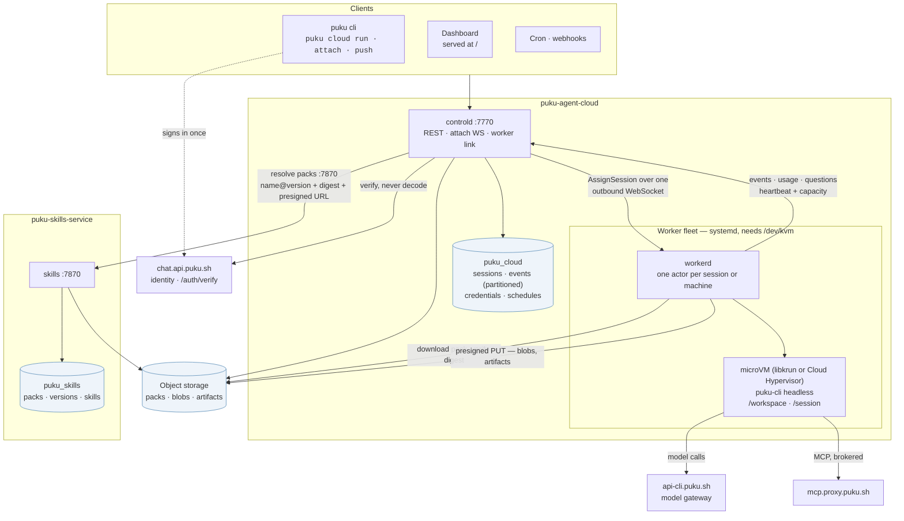
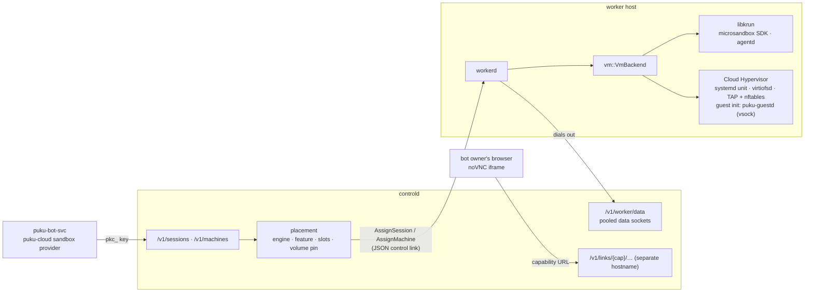
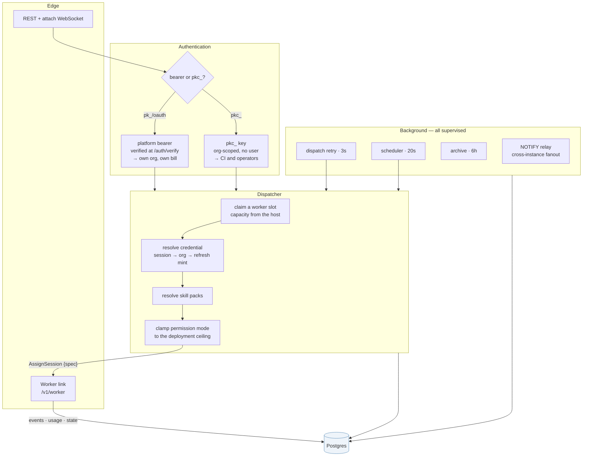
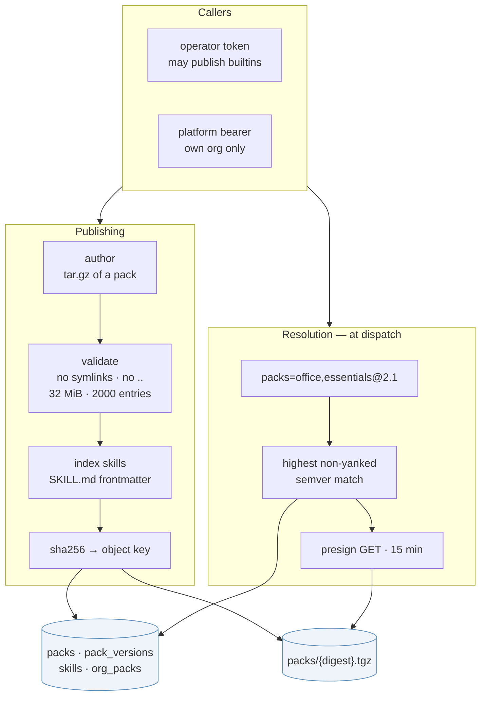
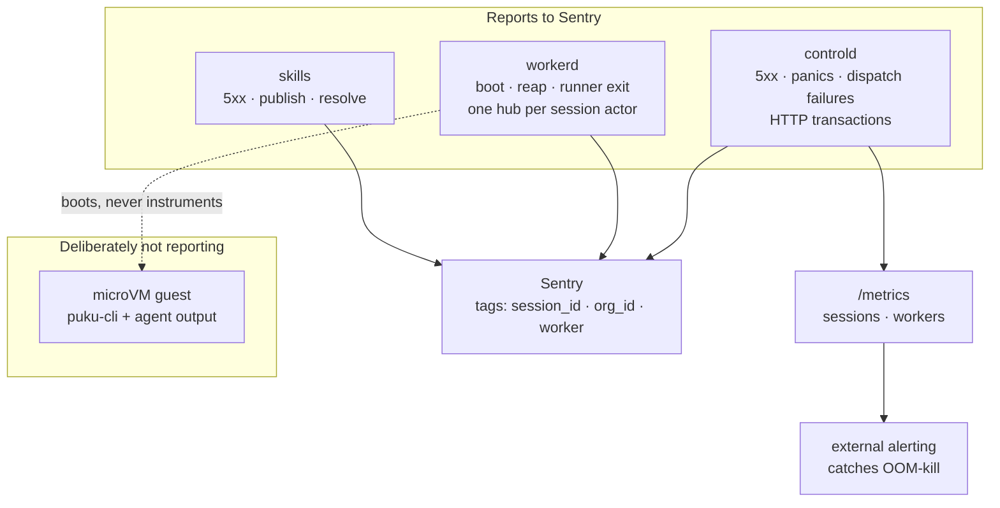

# Architecture

What the pieces are and how they fit. [SEQUENCE-FLOWS.md](SEQUENCE-FLOWS.md)
covers how a session moves through them over time; [DEPLOYMENT.md](DEPLOYMENT.md)
covers standing them up on a box.

- [The platform](#the-platform)
- [Engines and machines](#engines-and-machines)
- [Inside controld](#inside-controld)
- [Inside puku-skills-service](#inside-puku-skills-service)
- [Where the telemetry goes](#where-the-telemetry-goes)

---

## The platform

Two independent deployments — the control plane and the skills registry —
each with its own Postgres, sharing object storage.

**The worker never talks to the skills registry.** controld resolves packs at
dispatch and puts `name@version` plus a digest and a presigned URL on the
session spec; the worker downloads the object and verifies the digest against
what controld told it. The guest gets neither a URL nor a token — it sees only
unpacked files. (`README.md` drew a `workerd → skills` edge for a while; it was
never real.)

**The agent is puku-cli itself, headless inside the microVM.** The platform
never reimplements the agent loop — it boots the VM, relays the event stream,
and gets the work back out. That one rule is what keeps a cloud session and a
local one the same agent.

---

## Engines and machines

**Two engines, one seam.** Everything above `vm::VmBackend` in workerd --
the outbox, the stdin fifo, reconcile, idle parking, machines -- is
engine-agnostic. Each request names an engine (`libkrun` by default); a
worker advertises the engines whose runtime checks pass on its host; and
controld only places a VM on a worker that advertised its engine. A worker
from before engines existed advertises nothing and is treated as
libkrun-only, which is what makes the field safe to add.

**Machines are VMs without puku-cli.** A session is an agent in a VM; a
machine is only the VM, driven from outside: exec, files, archives, guest
ports. puku-bot's computers are machines. Contract: [MACHINES-API.md](MACHINES-API.md).

**Bytes never ride the control link.** It is one JSON socket carrying every
session's events with no backpressure. Exec, file, archive and port traffic
takes a socket from a small pool each worker keeps dialled out to
`/v1/worker/data`, one stream per socket. Workers still never accept a
connection.

**Volumes pin placement.** Once a session or machine has run, its volume is
on that worker's disk and nowhere else. A resume or a start goes back there;
if the worker is gone for more than 15 minutes, a session fails with that
reason and a machine is re-placed with a fresh volume (`resumed: false`, so
the caller restores its own copy).

---

## Inside controld

Two things in here are easy to miss and both are load-bearing:

- **Credential resolution never falls back to the operator.** Session
  credential, then the org's — minting a fresh bearer from a stored refresh
  token if that is what it holds — and then nothing. A session with none is
  refused before a VM boots, unless `PUKU_ALLOW_OPERATOR_CREDENTIALS` is on.
- **Capacity comes from the host, not a config value.** The worker advertises
  `used + what still fits` on every heartbeat, so a filling box stops being
  assigned work and recovers on its own.

---

## Inside puku-skills-service

A content-addressed registry. Postgres owns identity and versioning; object
storage owns the bytes.

- **An org's pack shadows a builtin of the same name** — the lookup orders by
  `org_id IS NULL`, so publishing `office` privately overrides the shipped one
  without renaming anything.
- **The key is the digest**, so publishing identical bytes twice stores them
  once, and the worker can verify what it downloaded against what controld
  promised.
- **The guest never talks to this service** and never holds a token for it.

---

## Where the telemetry goes

**The microVM is outside the boundary on purpose.** A DSN inside a sandbox
running untrusted agent code is an exfiltration channel, and agent output —
the customer's work — would flow to a third party. The same reasoning
`connectors.rs` applies to refresh tokens.

**Correlation is by tag, not by distributed trace.** The worker protocol
carries no trace id, and a session lives minutes to hours — far too long to be
one transaction. Every event in all three services carries the same
`session_id`, which makes one session's failures searchable across them.

**What Sentry cannot see stays on `/metrics`:** an OOM-kill or a stack
overflow never unwinds, so no panic hook fires. workerd boots microVMs, which
makes that a realistic way for it to die.

Field values are whitelisted before anything leaves the process — see
`crates/puku-observability/src/scrub.rs`. `SessionSpec` carries `prompt` and
`git_token`, so one careless `tracing::error!(?spec, …)` would ship a
customer's prompt and a GitHub token; a blacklist would fail open the first
time someone logged a field nobody had thought of.
