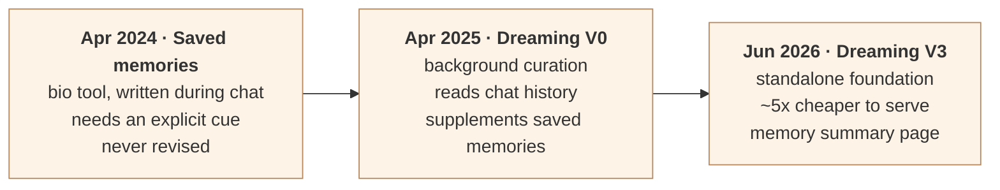
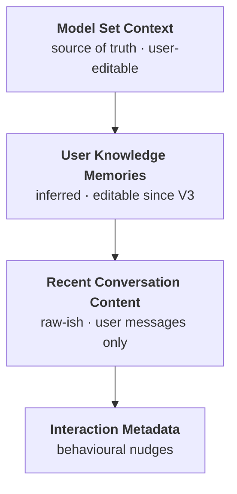
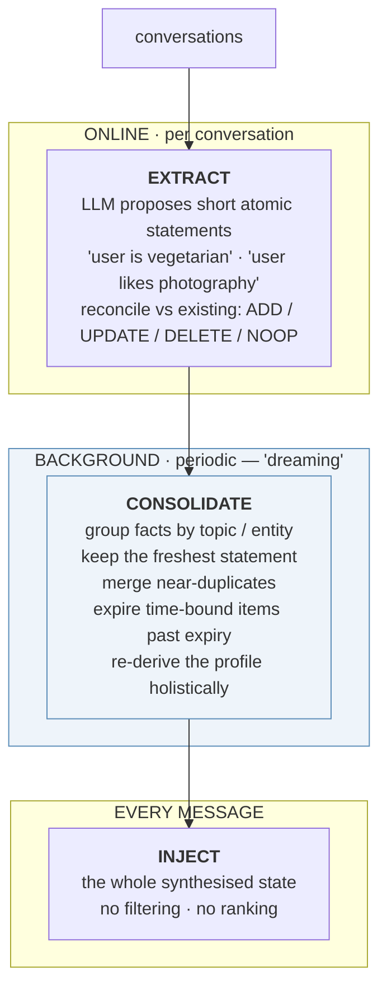

# How ChatGPT Memory Works

A study of ChatGPT's memory architecture — what it stores, how it is built,
and how it is used. Written 2026-09-01 to understand the design space before
designing memory for puku. No puku decisions are taken here; §10 lists
implications only.

---

## Contents

1. [TL;DR](#1-tldr)
2. [Source reliability](#2-source-reliability)
3. [Three generations](#3-three-generations)
4. [What is actually in the context window](#4-what-is-actually-in-the-context-window)
5. [There is no retrieval step](#5-there-is-no-retrieval-step)
6. [Dreaming: the consolidation job](#6-dreaming-the-consolidation-job)
7. [Time as a correctness problem](#7-time-as-a-correctness-problem)
8. [How OpenAI evaluates memory](#8-how-openai-evaluates-memory)
9. [Failure modes and attacks](#9-failure-modes-and-attacks)
10. [Comparison with the systems we evaluated](#10-comparison-with-the-systems-we-evaluated)
11. [Ideas worth stealing](#11-ideas-worth-stealing)
12. [What remains unknown](#12-what-remains-unknown)
13. [Glossary](#13-glossary)
14. [Sources](#14-sources)

---

> **Read this first.** This study predates OpenAI's Dreaming V3 announcement
> (2026) and is built from reverse engineering rather than primary sources. Its
> Tier B sections should be read against
> `puku-memory-service/docs/DREAMING-V3-COMPARISON.md`, which uses the
> published article. At least one claim here — that the inferred layers are not
> user-editable — is now known to be wrong.

## 1. TL;DR

ChatGPT's memory is **not a retrieval system**. There is no vector search over
your history at query time. Instead a background process called **dreaming**
periodically reads across all your conversations and re-synthesises a compact
profile of you; that entire profile is then stuffed into the context window on
every single message.

The engineering effort went into **keeping the stuffed payload small, fresh
and self-consistent** — not into ranking or fetching. Dreaming is the
compaction-and-correction pass that makes a no-retrieval design survivable at
hundreds of millions of users.

Three properties follow, and they are the interesting part:

- ChatGPT **cannot search your chat history**. It reads a profile derived from
  it. Ask about a specific conversation from a year ago and it has nothing.
- Memory is **rewritten over time**, not just appended or expired. "You're
  going to Singapore in July" becomes "You went to Singapore in July 2026"
  with no new input from you.
- The 2026 release shipped because it became **~5× cheaper to serve**, not
  because it became smarter.

---

## 2. Source reliability

Memory internals are partly announced and partly reverse-engineered, and the
blog layer around them invents freely. Every claim below is tiered:

| tier | source | trust |
|---|---|---|
| **A** | OpenAI's *Dreaming* announcement | vendor-stated; evals are self-reported with no published methodology |
| **B** | independent reverse engineering — Johann Rehberger (Embrace The Red), Shlok Khemani, Manthan Gupta, TheBigPromptLibrary | multiple independent observers, consistent, verbatim system-prompt dumps |
| **C** | secondary blogs summarising the launch | unreliable |

> ⚠️ **Known fabrication.** Several tier-C posts describe "memory chains with
> weighted relationships between facts" and "chain depth capped at 7 hops as
> deeper chains showed degraded retrieval precision." This appears in **no**
> primary or reverse-engineered source. It is invented detail. Discard it.

---

## 3. Three generations



### Gen 1 — Saved memories (April 2024)

The model calls a `bio` tool mid-conversation to write a fact. Write-time
only, and it needed **strong cues** — an explicit *"remember I'm traveling to
Singapore in July."*

OpenAI's own retrospective is unusually blunt (tier A):

> "In practice, interacting with this system could feel like talking to
> someone who took a few notes, but still forgot everything that wasn't
> written down. Saved memories also tend to go stale over time and eventually
> become incorrect or irrelevant."

Two **distinct** defects, which matters because they need different fixes:

| defect | meaning | fixed by |
|---|---|---|
| **coverage** | only explicitly flagged things were written | a background pass over all conversations |
| **staleness** | what was written was never revised | holistic re-derivation over time |

### Gen 2 — Dreaming V0 (April 2025)

Added the ability to reference chat context *outside* the saved-memories list:

> "a method for ChatGPT to automatically curate memories in the background by
> referencing chat history"

The load-bearing word is **background**. Gen 1 wrote *during* a conversation;
Gen 2 added a process that runs *after*, across many. That fixed coverage —
context now gets captured "without relying on explicit requests to remember
something."

It did not fix everything: *"it historically was never sufficient as a
standalone memory system."*

### Gen 3 — Dreaming V3 (June 2026)

Now the foundation rather than a supplement. The stated motivation is a
**scale** problem, not a quality one:

> "developed to tackle the staleness, correctness, and scalability challenges
> that we observe when memory is applied to the hundreds of millions of users
> and multi-year time horizons in ChatGPT"

And the enabling change is cost:

> "Recent improvements reduced the compute required to serve dreaming to Free
> users by approximately 5x"

That 5× is why it shipped. Users also get a **memory summary page** — the
synthesised state made reviewable, where you can "add or update information
about yourself, and provide instructions on what topics ChatGPT should bring
up and when."

---

## 4. What is actually in the context window

Tier B. The announcements never describe this; the reverse engineering is
strikingly consistent across independent observers. Roughly six blocks are
injected on **every message**:

```
┌─────────────────────────────────────────────────────────────┐
│ System instructions · developer instructions                │
├─────────────────────────────────────────────────────────────┤
│ # Model Set Context                    ← saved memories     │
│   [2025-05-02]. The user likes ice cream and cookies.       │
│   [2025-05-04]. The user lives in Seattle.                  │
├─────────────────────────────────────────────────────────────┤
│ # Assistant Response Preferences       ┐                    │
│   ~15 entries, Confidence=high         │                    │
│ # Notable Past Conversation Topics     ├─ "User Knowledge   │
│   behavioural patterns, confidence-tagged   Memories" —     │
│ # Helpful User Insights                │  LLM-written,      │
│   ~14 entries: name, job, location     ┘  not user-visible  │
├─────────────────────────────────────────────────────────────┤
│ # Recent Conversation Content                               │
│   ~40 chats · MMDDT[HH:MM] Topic: msg ||| msg ||| …         │
│   USER MESSAGES ONLY — never assistant replies              │
├─────────────────────────────────────────────────────────────┤
│ # User Interaction Metadata                                 │
│   ~17 fields: device, timezone, VPN, model-usage mix …      │
├─────────────────────────────────────────────────────────────┤
│ Current session messages (sliding window)                   │
└─────────────────────────────────────────────────────────────┘
```

### 4.1 `Model Set Context` — the saved memories

Timestamped one-liners written by the `bio` tool (the model addresses a
message `to=bio`). Fully **visible and editable** in settings. Observed format:

```
[2025-05-02]. The user likes ice cream and cookies.
[2025-05-04]. The user lives in Seattle.
```

**Highest precedence** — when blocks conflict, this is treated as source of
truth.

### 4.2–4.4 The inferred layers ("User Knowledge Memories")

Three blocks, all LLM-written, all confidence-tagged, none user-editable:

- **`Assistant Response Preferences`** — inferred style preferences. Observed
  header: *"These notes reflect assumed user preferences based on past
  conversations. Use them to improve response quality."*
- **`Notable Past Conversation Topics Highlights`** — behavioural patterns.
  Rehberger's own profile contained *"User systematically evaluates memory
  capabilities and vulnerabilities of LLMs"* — an inference about him, not a
  fact he stated.
- **`Helpful User Insights`** — name, profession, location, expertise.

Khemani describes these collectively as hundreds of conversations condensed
into roughly **ten paragraphs** of interconnected blocks: professional life
first, interaction style last. Periodically regenerated. **Not visible in
settings, not editable.**

> **Superseded, 2026-09-02.** OpenAI's Dreaming V3 announcement states the
> opposite: the dreaming-synthesised memories *are* reviewable on a memory
> summary page, where a user can "add or update information about yourself, and
> provide instructions on what topics ChatGPT should bring up and when". This
> paragraph was reverse-engineered before V3 shipped. See
> `puku-memory-service/docs/DREAMING-V3-COMPARISON.md`, which is written from
> the primary source.

### 4.5 `Recent Conversation Content`

The last ~40 conversations, timestamped and topic-labelled:

```
MMDDT[HH:MM] Conversation Topic: [user's first message] |||| [next] ||||
```

**Only the user's messages — never the assistant's replies.** That single
choice does two jobs: it halves the volume, and it removes the path by which
the model's own output (which may contain content from a poisoned web page it
read) re-enters a later context.

### 4.6 `User Interaction Metadata`

~17 auto-generated fields: device and screen dimensions, browser/OS, dark
mode, approximate location, timezone, VPN status, account age, subscription
tier, model-usage distribution, message-length patterns, intent tags.
Ephemeral — injected per session, not persisted.

### 4.7 Precedence



Khemani's analogy is the best mental model available:

| layer | analogous to |
|---|---|
| User Knowledge Memories | **pretrained weights** — dense, slow-changing |
| Model Set Context | **RLHF** — explicit steering, high precedence |
| Recent Conversation Content | **in-context learning** — fresh examples |

---

## 5. There is no retrieval step

The finding that surprises everyone, and the most important one here.

**No RAG. No vector search. No selective retrieval.** Every block above is
included in full, on every message. Khemani:

> "OpenAI just includes everything with every message... All of it, every time."

Rehberger tested the obvious alternative hypothesis and it failed:

> "I tried 3 times with very specific topics and one-off conversations that go
> back a year or so, and ChatGPT did not know that we had those conversations
> when asked."

So ChatGPT **cannot search your chat history**. History feeds a profile
offline; the profile is what gets read. A specific old conversation
contributed to the profile but is not itself retrievable.

The bet being made:

> "that context windows will keep growing while costs keep falling. Including
> all memory components regardless of relevance seems wasteful today but
> becomes trivial when context is cheap."

Khemani frames it as the bitter lesson applied to memory: rather than build
clever retrieval scaffolding, rely on the model being good enough to ignore
irrelevant context, and let compute handle the rest.

---

## 6. Dreaming: the consolidation job

If you stuff everything every time, the payload must stay small, fresh, and
self-consistent. **That is dreaming's entire job.** It is not a retrieval
system — it is the compaction and correction system that makes a no-retrieval
design viable.



The critical asymmetry:

| stage | scope | can it resolve contradictions? |
|---|---|---|
| extract | incremental, local — one conversation | no |
| consolidate | holistic, global — all facts for a topic | **yes** |

You can only notice that three facts contradict and one supersedes the rest by
looking at all of a topic at once. That is why it cannot be done
per-conversation, and why Gen 1 (write-time only) could never fix staleness.

The inherent cost:

> "Since dreaming runs as a periodic offline job, a change/correction in
> memory will not be consolidated till the next run."

**[unverified]** Whether consolidation triggers on account idle time, a fixed
cadence, or write volume is not documented in any credible source.

---

## 7. Time as a correctness problem

What most distinguishes this from open-source memory libraries: OpenAI treats
**the passage of time** as a first-class correctness objective with its own
eval.

> "Time doesn't stop when your chat ends."

Their canonical example: memory revising itself from *"You're going to
Singapore in July"* to *"You went to Singapore in July 2026"* once the trip
ends.

Note what that actually requires. It is **not** decay, and **not** a TTL. It
is the consolidation job **rewriting a fact into a different tense and a
different meaning** because the calendar moved:

```
stored 2026-05-10:  "The user is going to Singapore in July"
                      │  no new input — only time passes
                      ▼
after  2026-08-01:  "The user went to Singapore in July 2026"
```

A stored string became false through nothing but elapsed time. Very few memory
systems model this at all — most treat a memory as immutable once written, and
offer deletion as the only correction.

Their staleness eval shows the largest improvement of the three (9.4% → 75.1%),
which suggests it was also the worst problem.

---

## 8. How OpenAI evaluates memory

Worth copying wholesale — it is a better articulation of *what memory is for*
than most systems manage. Three objectives, in their words:

1. **Carry forward useful context** — "You tell ChatGPT something once, and it
   remembers that information in your subsequent chats."
2. **Follow preferences and constraints** — "If you describe a preference
   (e.g., you're vegetarian), then ChatGPT should take actions that are
   consistent with that preference going forward."
3. **Stay current over time** — "Memory should account for the passage of
   time."

| objective | 2024 saved | 2025 + V0 | 2026 V3 |
|---|---|---|---|
| Carry forward context | 41.5% | 67.9% | **82.8%** |
| Follow preferences | 31.4% | 55.3% | **71.3%** |
| Stay current over time | 9.4% | 52.2% | **75.1%** |

Self-reported, no published methodology. The **shape** is more informative
than the numbers: even the newest system is wrong a fifth to a quarter of the
time, and **preference adherence is the weakest of the three** — which is
precisely the axis that would matter most for a coding agent.

They also decompose "preference" into three kinds:

| kind | example |
|---|---|
| response instruction | "don't bring up Stan again" |
| stated constraint | "I'm vegetarian" |
| **implicit context that shapes relevance** | "I live near San Francisco" |

The third is the hard one — nobody states it as a preference, but it silently
changes what a good answer looks like.

---

## 9. Failure modes and attacks

Tier B, mostly from Rehberger's security work.

| failure | mechanism | why it matters |
|---|---|---|
| **Memory injection via `bio`** | untrusted content the model reads causes it to write a memory | persists into *every* future conversation — a persistence primitive, not a one-shot exploit |
| **Injection via Recent Conversation Content** | the summary field admits limited injection ("some trickery") | lower severity, same shape |
| **Profile opacity** | inferred layers can't be seen, edited or deleted | behaviour unreproducible across accounts, unexplainable to the user |
| **Silent revision** | Gen 3 rewrites facts autonomously | more correct, simultaneously **less auditable** — the user never sees when or why memory changed |
| **Bad memory > no memory** | stale or conflicting injected context degrades output below the no-memory baseline | the single most important operational fact about memory systems |

Excluding assistant replies from `Recent Conversation Content` (§4.5) is best
understood as a **security mitigation** that also happens to halve volume:
model output is the most likely carrier of content lifted from a poisoned page.

---

## 10. Comparison with the systems we evaluated

| | ChatGPT (Dreaming V3) | CF Agent Memory | mem0 | Cognee |
|---|---|---|---|---|
| retrieval at query time | **none — stuff everything** | vector + keyword + LLM synthesis | vector search, scored | graph traversal + vector |
| background consolidation | **yes — the core mechanism** | dedup by topic key at ingest | ADD/UPDATE/DELETE/NOOP at ingest | ontology induction |
| holistic re-derivation | **yes, periodic** | no | no | partial |
| temporal rewriting | **yes** | no | no | no |
| typed memories | implicit | fact / event / instruction / task | facts | entities + relations |
| user-editable truth layer | yes (`Model Set Context`) | `remember()` | yes | datasets |
| self-hostable | n/a | **no** | yes | yes |

The column that stands out: **nothing else does holistic re-derivation or
temporal rewriting.** Every other system here treats memory as append-plus-
dedup at write time. That is exactly the Gen 1 design OpenAI describes as
feeling like "someone who took a few notes, but still forgot everything that
wasn't written down."

---

## 11. Ideas worth stealing

Design implications only. No decisions taken.

1. **Two-speed writing.** Cheap incremental extraction per session, plus a
   periodic global pass that re-derives the whole profile. Only the second can
   resolve contradictions, and it cannot be done incrementally.
2. **No retrieval may beat retrieval.** If the consolidated state is small
   enough, stuffing it beats ranking it: no relevance model to get wrong, no
   latency on the hot path, no empty-result case.
3. **Two layers, not one.** A user-editable truth layer with highest
   precedence, over an inferred layer. Let the editable one win conflicts.
4. **Model time explicitly.** Facts have tense. A memory can become false with
   no new input; the fix is rewriting it, not expiring it.
5. **Never remember assistant output.** Halves the volume and closes the main
   injection path in one move.
6. **Evaluate on three axes**, not one: carry-forward, preference adherence,
   temporal currency. Preference adherence is the hardest and the most
   valuable.

The constraint underneath all of it: **a bad memory is worse than no memory.**
Precision matters more than coverage.

---

## 12. What remains unknown

- The consolidation schedule and its trigger.
- The storage substrate for the synthesised state.
- Whether Gen 3 adds provenance — which chat a memory came from. A tier-C
  source claims it does; the OpenAI announcement does not mention it.
- How memory capacity is bounded per user, and what is dropped at the limit.
- How the memory summary page relates to the injected blocks — whether it is a
  view over them or a separately generated artifact.

---

## 13. Glossary

| term | meaning |
|---|---|
| **`bio` tool** | the function the model calls (`to=bio`) to write a saved memory |
| **Model Set Context** | the system-prompt block holding saved memories |
| **User Knowledge Memories** | the LLM-written, non-editable inferred profile (three blocks) |
| **Dreaming** | the background process that re-synthesises memory from chat history |
| **Consolidation** | the holistic pass: group by topic, keep freshest, merge, expire |
| **Saved memories** | Gen-1 explicit memories, written during a conversation |
| **Reference chat history** | the setting that enables dreaming over past chats |

---

## 14. Sources

**Tier A**
- OpenAI, *Dreaming: Better memory for a more helpful ChatGPT* — https://openai.com/index/chatgpt-memory-dreaming/

**Tier B**
- Shlok Khemani, *ChatGPT Memory and the Bitter Lesson* — https://www.shloked.com/writing/chatgpt-memory-bitter-lesson
- Johann Rehberger, *How ChatGPT Remembers You* — https://embracethered.com/blog/posts/2025/chatgpt-how-does-chat-history-memory-preferences-work/
- Manthan Gupta, *ChatGPT memory* — https://manthanguptaa.in/posts/chatgpt_memory/
- llmrefs, *Reverse engineering ChatGPT memory* — https://llmrefs.com/blog/reverse-engineering-chatgpt-memory
- TheBigPromptLibrary, *ChatGPT bio tool and memory* — https://github.com/0xeb/TheBigPromptLibrary/blob/main/Articles/chatgpt-bio-tool-and-memory/chatgpt-bio-and-memory.md

**Tier C** (used only for pipeline framing, not for specifics)
- Pratik Pandey, *AI Memory: Learning from ChatGPT's Memory* — https://pratikpandey.substack.com/p/ai-memory-learning-from-chatgpts
