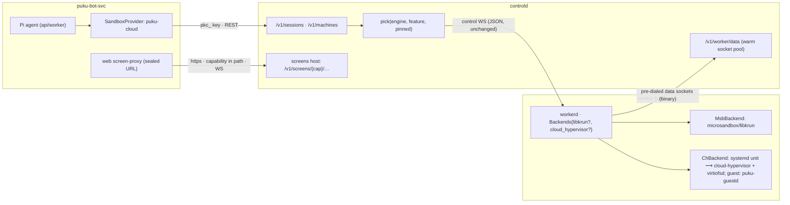

# Plan: Cloud Hypervisor engine in puku-agent-cloud + puku-bot-svc computers on agent-cloud

## KVM test results (2026-09-14)

The runbook (docs/KVM-TEST-GUIDE.md) was run on an x86_64 Ubuntu 24.04
host (kernel 6.8) with cloud-hypervisor v53.0, guest kernel ch-6.16.9, and
msb 0.6.9. **Every required test passed on both engines.**

| Area | Tests | Result |
|---|---|---|
| Build, suite and clippy | §1 | Pass |
| Both engines advertised | §3 | Pass |
| Backward compatibility | T1 | Pass |
| Engine routing and the unblocked queue | T2 | Pass |
| Cloud Hypervisor sessions | T3 | Pass: overlay root, virtiofs, TAP, stop/resume on the same worker |
| Machines smoke script | T4 | libkrun 31/0, Cloud Hypervisor 30/0 plus the known msb INFO line |
| Egress allowlist | T5 | Pass: NXDOMAIN, allowed host reachable, raw IP blocked, nft set populated with TTLs |
| `systemctl restart puku-workerd` | T6 | Pass: 2 sessions and 2 machines reattached, empty drift |
| puku-bot's computer, both engines | T8 | Pass: live canary green on both, noVNC served through a capability link |
| Fleet drift | T10 | Pass |

T7 (a second worker) and T9 (the real agent) were skipped as optional.

Fixed during the run:

- Cloud Hypervisor v53 needs `image_type=raw` on both disks. Without it, writes to sector 0 are refused, and the overlay mount fails.
- `…/ports/{port}/` and `…/links/{cap}/` 404'd, because the `{*rest}` route does not match an empty rest. noVNC's own URLs use the slash form.
- The runbook's `msb` commands now name `MSB_HOME`, so images land in the store workerd reads.
- A quoting bug in the smoke script, and a polling budget too tight for a loaded test database.

## Implementation status (2026-09-14)

Nothing is committed yet. The changes are in the working trees of both
repos: puku-agent-cloud on branch `feat/engines-cloud-hypervisor`, and
puku-bot-svc as uncommitted changes.

| Phase | State | Verified by |
|---|---|---|
| **P0** Engine field and seam | Done | See P0 below |
| **P2** Machines API | Done | See P2 below |
| **P3** `puku-cloud` provider (puku-bot-svc) | Done | See P3 below |
| **P1** Cloud Hypervisor engine | Done; verified on KVM (see above) | See P1 below |
| **P4** Rollout | Not started | Needs the box; steps are in DEPLOYMENT.md Step 7b |

**P0 — engine field and seam**

- Protocol: `Engine` on specs and requests (default `libkrun`) and `engines`/`features` on `Register`. Older workers are treated as libkrun-only.
- Placement: `pick(engine, feature, slots, pinned)`.
- Fixes: the dispatch stall, resume pinned to `volume_worker_id`, `vm::VmBackend` with the msb implementation, `KillMode=process`, paginated inventory, the attach ownership check, and a chown of the guest dirs.
- Verified by:
  - `cargo test --workspace` against Postgres, including new integration tests for old workers, stall, pinning, gone host, 400 on an unknown engine, schedules and attach.
  - clippy with `-D warnings`.
  - A real libkrun session on macOS ran through the new seam to `completed`.

**P2 — Machines API**

- Covers lifecycle, exec, files, archive, the port proxy, capability links and the pooled data plane.
- Verified by:
  - 10 integration tests.
  - An end-to-end run on real libkrun microVMs on macOS: create, exec (as the default user, with env and secrets, timeout 124, stdin), files (put, get, 413, list), archive get and merge put, the port proxy and links to a guest httpd, a forged link returning 404, reattach after a workerd restart, stop then start with `resumed: true` and the file still there, and destroy.

**P3 — `puku-cloud` provider (puku-bot-svc)**

- Command builders are shared through `packages/core/src/computer-commands.ts`.
- Verified by:
  - Offline conformance, fault and adapter tests: 45 in the four puku-cloud test files; 1435 in the full adapters, supervisor, core and contracts run.
  - The **live canary against the real local agent-cloud** passing. It used puku-bot's real computer image on libkrun: provision, exec, write, observe, stop, re-provision with `fresh: false` and the file preserved, destroy.

**P1 — Cloud Hypervisor engine**

- Pieces written:
  - `puku-guestd`: init plus the vsock agent.
  - `vm::ch`: systemd units, virtiofsd, TAP and nftables, the allowlist DNS filter, and image staging.
  - Deploy scripts: `prestage-ch.sh`, `build-ch-rootfs.sh` and an engine-aware `preflight.sh`.
- Verified so far:
  - Unit tests on macOS.
  - Linux container runs: guestd 12/12 (exec, stdin, process-group timeout, splice) and workerd 104/104.
- On real KVM: every required test in docs/KVM-TEST-GUIDE.md (see "KVM test results" above).

**Still to do**

1. The real agent on Cloud Hypervisor (runbook T9), which costs model usage.
2. A resume on a two-worker fleet (T7).
3. P4, the production rollout (DEPLOYMENT.md Step 7b; puku-bot staging, then production).

**Known limitations**

- **msb port publishing:** its forwarder does not pass on the guest's half-close. A response that ends by closing the connection (no `Content-Length`) stalls through a published port until the client gives up, even with a direct connection. puku-bot's `control.py` and noVNC send lengths. The Cloud Hypervisor path uses its own splice.
- **Egress allowlist on Cloud Hypervisor:** it is DNS-driven, so it inherits the usual CDN shared-address approximation.
- **Data plane:** it assumes a single controld instance. That is already true today, because the worker registry and event hub are in-memory.
- **`puku-oauth.test.ts`:** the existing test in puku-bot-svc fails to load because `jose` is missing from `apps/api`. This work doesn't touch it.

## Context

- **puku-agent-cloud today.** Each session is one microVM created through the
  microsandbox SDK 0.6.9 (libkrun), with puku-cli running headless inside it.
  - The microsandbox SDK is called from only three files: `crates/puku-workerd/src/{session_actor.rs,controlplane.rs,main.rs}`.
  - There is no backend seam. The system works and must keep working.
- **puku-bot-svc today.** The Pi agent runs in the API and worker processes. It drives a remote *computer* through `SandboxProvider` (`packages/adapter-kit/src/interfaces.ts:64`).
  - The Docker backend is a thin HTTP client (`packages/adapters/src/docker-sandbox.ts`).
  - It calls the supervisor (`infra/sandboxes/supervisor`, which uses dockerode).
  - The supervisor runs the computer image (`infra/sandboxes/computer`): Xvfb, x11vnc, noVNC on `:6080+2i` (view) and `:6081+2i` (control), `control.py` on `:7070`, Chromium, uid 1000, `HOME=/home/pukubot`.
- **Goal.**
  1. Add **Cloud Hypervisor (CH)** as a second VM engine in agent-cloud, next to libkrun.
     - Each request picks its engine.
     - Each engine has its own on/off switch.
     - Fully backward compatible.
  2. Add a generic **machine** resource to agent-cloud: lifecycle, exec, files, archive, and a proxy to guest ports.
  3. Add a `puku-cloud` SandboxProvider to puku-bot-svc so bot computers can move from Docker onto agent-cloud microVMs, ending on CH.

**Decisions you already made:**
- The VM hosts the **computer only**. The agent loop stays in puku-bot-svc.
- **libkrun stays.** CH is added beside it.
  - The engine is chosen in the request payload.
  - Each engine has an enable flag.
  - The default is `libkrun`, so old clients and old workers see no change.

---

## Audit findings (existing issues surfaced while auditing)

**puku-agent-cloud**

| # | Finding | Evidence | Action |
|---|---|---|---|
| 1 | The workerd unit has no `KillMode`, so `systemctl restart puku-workerd` very likely kills every msb VM (msb only calls `setsid`; the VMs stay in the unit's cgroup). This breaks the "VM survives workerd" reattach story. | `deploy/systemd/puku-workerd.service`; msb `runtime/spawn.rs:544` | P0: `KillMode=process`; verify with `systemd-cgls -u puku-workerd` |
| 2 | Resume clears `worker_id`, and `pick()` has no affinity. On more than one worker, a resumed session can land on a host without its volumes. | `api/mod.rs:1116-1118`, `workerlink/mod.rs:84` | P0: add a `volume_worker_id` column and pin resume to it |
| 3 | `Sandbox::list()` returns only the first page, so the heartbeat inventory and fleet drift detection are incomplete at scale. | `controlplane.rs:370-378` | P0: page through with `list_with`, filtered on the `puku.managed` label |
| 4 | Host session dirs are root-owned, and the guest runs as uid 1000, so the runner hits EACCES. | `runner.mjs:648-652` | P0: chown the dirs to 1000 |
| 5 | The attach WebSocket checks only the org, not `owns()`, so any user in the org can attach to another user's session. | `api/mod.rs:2261` | P0 fix |
| 6 | `PUKU_AGENT_IMAGE` in the workerd unit does nothing (workerd has no such arg). `msb_version` in `Register` reports workerd's own crate version. | unit line 17; `controlplane.rs:380` | P0 cleanup |
| 7 | When `max_duration` is hit, the VM dies with no exit marker, and the session ends as `Stopped` rather than `Failed`, only after the idle timeout. | `session_actor.rs:496,718` | Documented; the CH backend keeps the same semantics |
| 8 | In production, credentials are passed into the guest as plain env. Secret MITM injection is off because puku-cli stalls behind it. | `session_actor.rs:527-559` | Known; unchanged |
| 9 | `docs/PUKU-BOT-PLAN.md` describes an old design (OpenMausBot fork plus a puku-cli driver) that doesn't match puku-bot-svc. | — | Mark it as superseded by this plan |

**puku-bot-svc**

| # | Finding | Evidence |
|---|---|---|
| 1 | The Docker backend claims `multiScreen: true`, but it never sends a screen id, so every Team bot shares screen 0. The docs overstate this. | `docker-sandbox.ts:63-73`, `docs/computer-runtime.md:19` |
| 2 | Production compose defaults to `SANDBOX_PROVIDER=e2b`. Docker only runs with the `docker-compose.docker-sandbox.yml` overlay. | `docker-compose.prod.yml:57,110` |
| 3 | `computerHost` is documented but doesn't exist in the code. | `docs/api.md:195` |
| 4 | The Docker computer container has no CPU or memory limits. | `computer-spec.ts:78-112` |

---

## Target architecture

**Sequencing.** P0 comes first. After it, two tracks run in parallel:
- **Track A (CH engine):** P1.
- **Track B (machines, then the puku-bot adapter):** P2 and P3. This track runs on libkrun, which already supports exec, `fs()` and `port_bind` in SDK 0.6.9, and on macOS for development.

P4 joins the tracks: puku-bot machines on CH in production.

---

## P0 — Engine selection + seam (agent-cloud, no behaviour change)

### Protocol (`crates/puku-cloud-proto`)

There is no `deny_unknown_fields` anywhere in the crate, so adding fields with `#[serde(default)]` is safe in both directions.

- New file `src/engine.rs`:
  - `enum Engine { Libkrun, CloudHypervisor, #[serde(other)] Unsupported }`
  - Serialized as snake_case: `"libkrun"` / `"cloud_hypervisor"`.
  - `Default` is `Libkrun`.
- `SessionSpec.engine` (`session.rs:263`), `#[serde(default)]`.
  - Old `spec.json` files still load when a restarted worker reconciles (`controlplane.rs:83`).
- `Up::Register` gains four fields:
  - `engines: Vec<Engine>`. Empty means `[Libkrun]`, which covers every old worker.
  - `features: Vec<String>`
  - `running_machines`
  - `on_disk_machines`
- `Up::Heartbeat` gains `engine_capacity: HashMap<Engine,u32>`.
  - The existing `sandboxes` name list stays shared across engines.

### controld

- Engine config:
  - `PUKU_ENGINE_DEFAULT` (default `libkrun`).
  - `PUKU_ENGINES_ALLOWED` (default `libkrun`). A disallowed engine gets 400 at the edge, next to the permission clamp (`api/mod.rs:335`).
- Carry `engine` through:
  - `CreateSessionReq` (`:287`)
  - `ImportSessionReq` (`:383`)
  - `CreateScheduleReq` (`:1139`), plus the schedules table and `scheduler.rs`
  - `triggers.rs` uses the deployment default
  - `NewSession`, insert, `SESSION_COLS`, `SessionRow` (`db/mod.rs:10-189`)
  - `build_spec` (`api/mod.rs:1993`)
- Migration `migrations/0021_engine.sql`:
  - `sessions.engine text NOT NULL DEFAULT 'libkrun' CHECK(...)`
  - `sessions.volume_worker_id uuid`
  - `workers.engines text[] DEFAULT '{libkrun}'`
  - `workers.features text[] DEFAULT '{}'`
- `WorkerRegistry::pick(req: {engine, feature: Option, pinned: Option<Uuid>})` (`workerlink/mod.rs:84`) only returns workers that advertised that engine or feature.
- **Dispatch stall fix:** `dispatch_pending` (`api/mod.rs:2071`) currently `return`s when no worker is available.
  - Move `pick` inside the loop and `continue` instead, so a queued CH session can't block libkrun sessions behind it.
  - Emit an event when no connected worker supports the requested engine.
- Resume uses `pinned = volume_worker_id`. If that worker stays offline past a grace period, fail with a clear error.
- `/v1/fleet` and the dashboard show the engines per worker.

### workerd

- Flags (clap and env):
  - `PUKU_ENGINE_LIBKRUN` (default `true`).
  - `PUKU_ENGINE_CLOUD_HYPERVISOR` (default `false`).
  - An engine is advertised only if its flag is on **and** its runtime check passes.
- New `crates/puku-workerd/src/vm/`:
  - `mod.rs`:
    - `VmSpec { name, image, cpus, memory_mib, mounts, labels, max_duration, env, secrets, egress, multi_tenant, ports }`
    - `ExecOpts { user, cwd, env, timeout, stdin: Option<Bytes> }`, `ExecOut { code, stdout, stderr }`
    - `trait VmBackend { create, attach, remove, list, prepull, version }`: `remove` is idempotent with retries; `list` returns all pages
    - `trait Vm { name, exec, stop, connect_port(u16) -> AsyncRead+AsyncWrite }`
    - `Backends { libkrun: Option<Arc<dyn VmBackend>>, cloud_hypervisor: Option<…> }` (`async-trait`)
  - `msb.rs`: moves the existing calls verbatim from
    - `session_actor.rs:198-222`, `:343-356`, `:486-581`
    - `controlplane.rs:318`, `:370-383`
    - `main.rs:203-237`
  - `fake.rs`, `#[cfg(test)]`.
- `session_actor.rs` switches to `&dyn Vm`, chosen by `spec.engine`. `deliver_line` becomes `exec` with stdin bytes.
  - A spec for a disabled or unsupported engine fails immediately with a clear error.
- The four existing-issue fixes from the audit table:
  - `KillMode=process` in the unit.
  - Page through `list_with`.
  - Chown the session dirs to uid 1000.
  - The attach `owns()` check.

**Exit criteria**
- `cargo test --workspace` passes.
- New integration tests in `inttests.rs`, driven by `harness.rs`'s fake worker:
  - An old-format `Register` means libkrun only.
  - A CH spec is never sent to a libkrun-only worker.
  - A queued CH session doesn't block libkrun sessions.
  - Resume is pinned to `volume_worker_id`.
- Golden JSON tests: frames and specs from before the change still deserialize.

---

## P1 (Track A) — Cloud Hypervisor backend

### Guest: new crate `crates/puku-guestd` (static musl binary)

It runs as PID 1 via `init=/sbin/puku-guestd` and replaces what msb's agentd does.

- **Filesystems:**
  - Mount `/proc`, `/sys`, `/dev`, `/dev/pts`, `/dev/shm` (≥256 MiB, for Chromium), `/run` and `/tmp`.
  - Build the root as an overlay: a **read-only base ext4** (`vda`) under a **per-VM sparse upper ext4** (`vdb`), then `switch_root`.
  - Mount virtiofs tags: `session` at `/session`, `workspace` at `/workspace`.
- **Image config:** apply `/etc/puku/image-config.json` (the OCI config's ENV, USER, WORKDIR and CMD), which is lost by `docker export`.
- **Network:** configure `eth0` from the kernel command line (`puku.ip`, `puku.gw`, `puku.dns`).
- **vsock RPC** (length-prefixed JSON header, then raw byte frames):
  - `init{env, hostname}`. Env travels over vsock, not the kernel command line, so secrets never show up in `/proc/cmdline`.
  - `exec{argv, cwd, env, uid, stdin}` returns stdout, stderr and the exit code.
  - `connect{port}` splices to `127.0.0.1:port` inside the guest.
  - `ping`.
  - `shutdown`: sync, then power off.
  - Also reaps zombies.
- Guest OCI images stay unchanged. guestd is injected when the rootfs is built.

### Host: `crates/puku-workerd/src/vm/ch/{mod,unit,net,dns,vsock,image}.rs`

**`unit.rs`: one transient systemd unit per VM**

- Started with `systemd-run --unit=puku-vm-<name> --slice=puku-vms.slice --collect`, with `MemoryMax`, `TasksMax` and `RuntimeMaxSec` (the RuntimeMaxSec limit is `max_duration`).
- The unit runs `virtiofsd` (one per mount, `--sandbox=namespace`) and `cloud-hypervisor` with:
  - `--kernel vmlinux`: direct boot; a PVH `vmlinux` on x86_64, `Image` on aarch64.
  - `--disk path=base.ext4,readonly=on --disk path=upper.ext4`
  - `--fs tag=…,socket=…`
  - `--vsock cid=…,socket=vsock.sock`
  - `--net tap=…`
  - `--rng`
  - `--api-socket api.sock`
  - `--serial file=serial.log`
  - `--cpus boot=N --memory size=…M,shared=on`
- VMs outlive workerd restarts and get cgroup limits for free.

**State layout**

- Files live in `/var/lib/puku/vms/<name>/{vm.json, api.sock, vsock.sock, upper.ext4, serial.log}`.
- `list()`: scan the directory and call `GET /api/v1/vm.info`.
- `attach()`: reopen the vsock socket.
- `remove()`, idempotent: guestd `shutdown`, then `vmm.shutdown`, stop the unit, remove the TAP and nft entries, delete the directory.

**`net.rs` + `dns.rs`**

- Per-VM TAP with a /30 taken from `10.200.0.0/16`.
- nftables table `puku`, hooked in **before** Docker's FORWARD chain:
  - Masquerade outbound traffic.
  - Drop VM→host (except that VM's DNS), VM→VM, RFC1918, and link-local/metadata.
- **Allowlist mode** (matches msb's deny-by-default domain-suffix policy):
  - A per-VM DNS responder (hickory) answers only for allowlisted suffixes.
  - It puts the answers into that VM's nft IP set, with TTL expiry.
  - All other forwarded traffic is dropped.
  - The in-guest explainer proxy (`puku-egress-proxy.py`) is unchanged.
  - Known approximation: CDNs share IPs.
- **Open mode:** NAT only.

**`image.rs`**

- Maps `spec.image` to `/var/lib/puku/images/<name>@<digest>/{base.ext4,image-config.json}`.
- `prepull` means "is this image staged?". An unstaged image fails the session with a clear message.

**Isolation floor** (CH has no `DeploymentProfile::MultiTenant`), so define one explicitly:
- CH seccomp stays on.
- systemd resource limits.
- No secret MITM in v1: CH is not advertised when `--secret-env-injection` is on.

### Deploy

| File | Change |
|---|---|
| `deploy/scripts/prestage-ch.sh` | Pinned, checksummed `cloud-hypervisor`, `virtiofsd` and guest kernel into `/opt/puku/ch/`. Kernel config needs virtio-{blk,net,fs,vsock,console}, overlayfs, ext4 and vsock. |
| `deploy/scripts/build-ch-rootfs.sh <oci-ref>` | `docker create`/`export`, then `mkfs.ext4 -d` (preserving ownership and xattrs), then inject `/sbin/puku-guestd` and `image-config.json` from `docker inspect`. Called from `deploy-guest-image.sh` and `upgrade-box.sh` next to `msb load`. |
| `deploy/scripts/preflight.sh` | When CH is enabled, also check `/dev/kvm`, `/dev/vhost-vsock`, `/dev/net/tun`, the binaries, the kernel and `nft`. |
| `deploy/systemd/` | `puku-vms.slice`; `PUKU_ENGINE_*` settings in the workerd unit. |
| Docs | `docs/DEPLOYMENT.md` and `docs/ARCHITECTURE.md` get an engines section. |

**Exit criteria.** On the KVM box, `puku-cloud run --engine cloud_hypervisor` passes the whole `skills/deployment-test` sequence, and msb sessions on the same box are unaffected. The sequence covers:
- a run;
- question and answer;
- interrupt;
- park and resume;
- a workerd restart mid-session, where the VM survives and the outbox is re-tailed;
- artifacts;
- an allowlist block.

---

## P2 (Track B) — Generic `machines` resource (agent-cloud, on libkrun first)

### Protocol: `crates/puku-cloud-proto/src/{machine.rs,data_proto.rs}`

- **`MachineSpec`**
  - Identity: `machine_id`, `sandbox_name` (`mch-…`), `generation`.
  - Guest: `engine`, `image`, `cpus`, `memory_mib`, `expose: Vec<u16>`, `env`, `secret_env`, `egress_allow`.
  - Lifetime: `idle_timeout_s` and `max_duration_s`, both default 0 (off, omitted).
  - Startup: `entrypoint {argv, uid}`, `volume {guest_path, uid}`.
- **`MachineState`**: `created → scheduled → booting → running → stopping → stopped | failed | destroyed`.
- **New `Down` frames:**
  - `AssignMachine{spec, generation}`
  - `StopMachine{machine_id, generation}`
  - `DestroyMachine{machine_id}`
  - `OpenStream{stream_id, machine_id, target}`, the fallback when the socket pool is empty.
- **New `Up` frames:**
  - `MachineState{machine_id, generation, state, error?, volume_created}`
  - `StreamFailed`
- `RegisterAck` gains `reapable_machines`.
- **`StreamTarget`**: `Port{port} | Exec{argv,cwd,env,user,timeout_ms,stdin} | ArchiveGet{path,excludes} | ArchivePut{path} | FileRead{path,max_bytes} | FileWrite{path,mode} | List{path}`.
- **Data socket protocol:**
  1. A Text `StreamHeader`.
  2. Binary frames in both directions.
  3. A Text `eof` or `exit{code}` frame to finish.

### Data plane

Bulk bytes never go over the JSON control socket, whose channel is unbounded and has one sink.
- workerd keeps 2–4 idle sockets open to `WS /v1/worker/data`, authenticated with its worker token plus `worker_id`, with pings about every 30 s.
- controld takes one socket per request, and the worker refills the pool.
- HTTP to guest ports uses hyper http1 over the stream, `with_upgrades()`, which also carries websockify.
- This needs a single controld instance, which is already a constraint today (the worker registry and event hub live in memory).

### controld

**Migration `0022_machines.sql`**
- A `machines` table with these columns:
  - Ownership: `org_id`, `user_id`, `external_id` (unique per org).
  - Placement: `worker_id`, `volume_worker_id`, `engine`, `generation`.
  - State: `state` (with a CHECK), `spec jsonb`, `secret_env_enc` (via `secretbox`), `labels jsonb`.
  - Timestamps: `last_active_at` plus the usual timestamps.
- `quotas.max_concurrent_machines`.
- `usage_records` gets `machine_id` and `kind`, and uses `vm_seconds`.

**Routes: `api/machines.rs`, merged into the protected router before the auth layer (`api/mod.rs:24-62`)**

| Route | Behaviour |
|---|---|
| `POST /v1/machines` | Idempotent on `external_id`; returns `{machine, resumed}`. **`resumed` means the volume already existed.** |
| `GET /v1/machines[/{id}]`, `DELETE /{id}` | Get and list. Delete is idempotent: missing counts as success. |
| `POST /{id}/start` \| `/stop` \| `/touch` | `start` is pinned to `volume_worker_id`. If that worker is offline past a grace period, the machine is re-placed with `resumed=false`. |
| `POST /{id}/exec` | Returns `{stdout, stderr, code}`. A timeout returns 124. Output is capped. |
| `GET\|PUT /{id}/files?path=&mode=list\|read&max_bytes=` | Raw bytes; `mode` applies on write. |
| `GET\|PUT /{id}/archive?path=&exclude=` | Streamed tar. Above about 90 MB (the Cloudflare body limit), switch to object storage (MinIO) through the existing `RequestUpload` flow. |
| `ANY /{id}/ports/{port}/{*path}` | HTTP and WebSocket proxy, restricted to the ports in `expose`. |
| `POST /{id}/screens {view_port, control_port, policy, ttl}` | Returns `https://<screens-host>/v1/screens/{cap}/embed.html?...`. The capability is an HMAC over `(machine, ports, policy, exp)` and sits **in the path**, because the puku-bot proxy drops the query string on asset requests. |

**Other controld changes**
- The screen and port proxy is served on a **separate hostname** through the tunnel, with `Set-Cookie` stripped. Guest HTML must never share an origin with the dashboard.
- Dispatch goes through `pick(engine, feature: "machines", pinned)`.
  - Machines take `ceil(memory_mib/2048)` slots.
  - The model-credential gate (`api/mod.rs:2120`) applies to sessions only.
  - `generation` stops a late `StopMachine` from killing a newer boot.
- `/v1/fleet` learns the `mch-` prefix.
- Auth: one `pkc_` key per puku-bot deployment (a service org), with `labels.spaceId` for attribution.

### workerd

**`machine_actor.rs`**
- Persistent volume `/var/lib/puku/machines/<id>/home`, owned by uid 1000, mounted at `/home/pukubot`.
  - On msb it is a bind mount.
  - On CH it is a per-machine sparse ext4 disk. That is faster than virtiofs for Chromium profiles and npm.
- Start `entrypoint` as uid 1000 with an explicit `setsid` launcher, the same pattern as `launch_runner`. Don't rely on msb's hidden `background_command`.
- Reconcile after a restart the same way sessions do.

**`datalink.rs`**
- Keeps the socket pool.
- Dispatches each stream target:
  - **Port:** `Vm::connect_port`. On msb this is `port_bind(127.0.0.1, p, guest)` chosen at create time and saved in `vm.json`; on CH it goes through guestd.
  - **Exec:** `Vm::exec`.
  - **Files and archive:** msb uses `sandbox.fs()`; both engines can use `tar`/`cat` via exec.

**Exit criteria.** Integration tests against the fake backend cover:
- idempotent create;
- the `resumed`/`fresh` semantics;
- single-use stream tokens;
- the port allowlist;
- capability expiry and view vs control;
- the generation fence.

Then a manual run on macOS or the box: boot the puku-bot computer image on libkrun and open noVNC through the capability URL.

---

## P3 (Track B) — `puku-cloud` SandboxProvider (puku-bot-svc)

**Kind and shared helpers**
- Add `"puku-cloud"` to `SandboxKind` in `packages/contracts/src/ids.ts:42`. No Prisma change is needed: `Computer.kind` is a String.
- Move the pure helpers out of `infra/sandboxes/supervisor/src/supervisor-logic.ts` into `packages/adapters/src/computer-commands.ts`, and use them from both the supervisor and the new adapter:
  - `xdotoolCommand`, `screenPorts`, `containerActionStep(s)`
  - `ensureScreenCommand`, `interactiveScreenCommand`
  - `parseObservation`, `sandboxTimeoutCommand`, `sandboxCommandTimedOut`

**New `packages/adapters/src/puku-cloud-sandbox.ts`**

| SandboxProvider | agent-cloud call |
|---|---|
| `provision` | If `providerKind==="puku-cloud"` and there is a `providerRef`: `POST /{id}/start`. Otherwise `POST /v1/machines {external_id: homeKey, labels{spaceId}, image, engine, cpus, memory_mib, expose:[7070,6080,6081], secret_env{PUKUBOT_COMPUTER_CONTROL_TOKEN}, env (the computer-spec.ts:85-104 set)}`. `fresh = !resumed`. A 404 throws `sandbox <id> not found`, which matches `isSandboxGoneError`. |
| `prepare` | No-op. |
| `execute` | `/exec` with `boundedSandboxCommandTimeoutMs`. Timeout returns 124; abort returns 130. |
| `listFiles`, `readFile`, `writeFile` | `/files`, with `normalizeWorkspacePath` applied first. |
| `exportWorkspace`, `importWorkspace` | One streamed `/archive` tar, with `shouldSkipPortableWorkspaceFile` exclusions applied on the server side. |
| `observe`, `act` | `POST /ports/7070/v1/desktop` (control.py) using the control token, so act plus observe is a single round trip. Falls back to xdotool through `/exec`, the same as the supervisor. |
| `sendInput` | `/exec` using the shared xdotool builder. |
| `connectScreen`, `setScreenControl` | Exec `interactiveScreenCommand`, then `POST /screens` to get the URL. |
| `releaseScreen` | Exec. |
| `stop`, `destroy` | `/stop` and `DELETE`; a 404 counts as success. |
| `keepAlive` | `/touch`. |
| `snapshot` | Frame id, as E2B does. |
| `describe()` | `graphical`, `takeover`, `persistentHome` true; `snapshots`, `pty`, `multiScreen` false. Single-screen claims use `SingleScreenClaimTracker` (`computer-screens.ts:18`), as Box does. |

**Wiring**
- Add `puku-cloud` to `proxyExternal` in `apps/api/src/router.ts:1692`, so the https capability URL is AES-sealed and never visible to the browser.
- Config:
  - `sandbox-factory.ts`.
  - `sandbox-provider-env.ts`, with `PUKU_AGENT_CLOUD_URL`, `PUKU_AGENT_CLOUD_API_KEY`, `PUKU_AGENT_CLOUD_ENGINE` and `PUKU_AGENT_CLOUD_IMAGE`. A missing key falls back to `none`.
  - `apps/api/src/env.ts`, `apps/api/src/app.ts:177`, `apps/worker/src/index.ts:88`.
  - `packages/core/src/secrets-guard.ts` and `.env.example`.
- Other switches on `kind`:
  - `core/src/teach-recording.ts:66`
  - `computer-lifecycle.ts:426`
  - `apps/api/src/computer-status.ts:87`
  - `executor.ts:1280`
- Publish the computer image `infra/sandboxes/computer` as OCI (CI). agent-cloud stages it for both engines, via `msb load` and `build-ch-rootfs.sh`.
- Docs: add a puku-cloud backend section to `docs/computer-runtime.md` and fix the Docker multiScreen wording.

**Exit criteria**
- The new provider runs against an offline fake agent-cloud HTTP server in the `describe.each` lists of `sandbox-conformance.test.ts` and `sandbox-faults.test.ts`.
- Supervisor and `docker-sandbox.test.ts` tests still pass after the helper extraction.
- A new opt-in live canary passes: `VERIFY_PROVIDERS=puku-cloud pnpm test:canary`.

---

## P4 — Join and roll out

1. Enable CH on one worker: `PUKU_ENGINE_CLOUD_HYPERVISOR=true`, with `PUKU_ENGINES_ALLOWED=libkrun,cloud_hypervisor` on controld.
2. Run the session test sequence on CH.
3. Stage the computer image as a CH rootfs.
4. Point puku-bot staging at it: `SANDBOX_PROVIDER=puku-cloud`, `PUKU_AGENT_CLOUD_ENGINE=cloud_hypervisor`.
5. Run `pnpm test:computer`-style acceptance.
6. Flip production per deployment.

Rollback is flag-only on each side: `SANDBOX_PROVIDER=docker` in puku-bot-svc, `PUKU_ENGINE_CLOUD_HYPERVISOR=false` in agent-cloud. libkrun sessions are never affected.

## Later (explicitly out of scope)

- CH `vm.snapshot`/`restore` warm pools and fast resume.
- Multi-screen for puku-cloud.
- Secret MITM injection on CH.
- Multiple controld instances with stream routing.
- Disk quotas and memory-weighted capacity in `hostcap`.
- An unprivileged CH/virtiofsd user (`--translate-uid`).

---

## Verification summary

- **agent-cloud:**
  - `cargo test --workspace`.
  - `PUKU_TEST_DATABASE_URL=… cargo test -p puku-controld` (the integration tests: engine routing, stall fix, affinity, machines, streams, capabilities).
  - Golden-JSON compatibility tests.
  - `skills/deployment-test` on the KVM box for both `--engine libkrun` and `--engine cloud_hypervisor`, including `systemctl restart puku-workerd` mid-session.
- **puku-bot-svc:**
  - `pnpm test`, covering conformance, faults, supervisor and adapter unit tests.
  - Opt-in canary against staging agent-cloud.
  - Manual check: create a bot on `puku-cloud`, watch it observe and click, take control through the sealed screen URL, sleep and wake with files intact, destroy and re-provision so the home is restored from `AgentHomeStore`.
