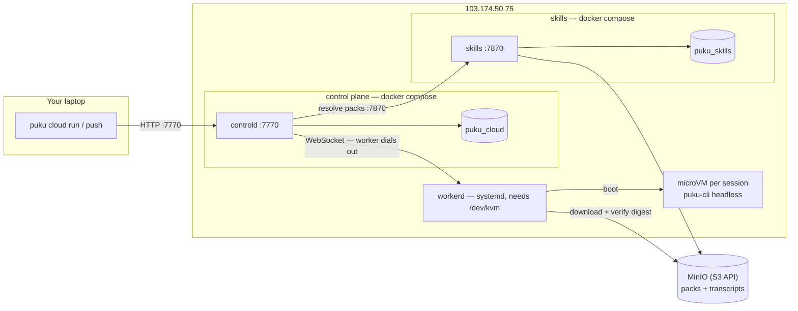

# Deploying the puku cloud (dev) on 103.174.50.75

Step by step, in order, ending with your laptop's `puku` CLI driving the
box. Every command says which machine it runs on.

Companions: [CLI-WALKTHROUGH.md](CLI-WALKTHROUGH.md) for using it day to
day, [API.md](API.md) and
[puku-skills-service/docs/API.md](../../puku-skills-service/docs/API.md) for
the HTTP surfaces.

- [What you are building](#what-you-are-building)
- [A note on exposure](#a-note-on-exposure)
- [Step 1 — prepare the box](#step-1--prepare-the-box)
- [Step 2 — generate secrets](#step-2--generate-secrets)
- [Step 3 — object storage](#step-3--object-storage)
- [Step 4 — skills service](#step-4--skills-service)
- [Step 5 — control plane](#step-5--control-plane)
- [Step 6 — guest images](#step-6--guest-images)
- [Step 7 — the worker](#step-7--the-worker)
- [Step 8 — verify on the box](#step-8--verify-on-the-box)
- [Step 8b — credentials](#step-8b--credentials-the-step-that-gets-skipped)
- [Step 9 — connect from your laptop](#step-9--connect-from-your-laptop)
- [Step 10 — the test sequence](#step-10--the-test-sequence)
- [Publishing it on a domain](#publishing-it-on-a-domain)
- [Rolling it out to a team](#rolling-it-out-to-a-team)
- [Operating it](#operating-it)
- [Troubleshooting](#troubleshooting)

---

## What you are building



| Piece | Port | Runs as |
| --- | --- | --- |
| controld | 7770 | docker compose |
| skills | 7870 | docker compose (separate stack, own Postgres) |
| workerd | none inbound | **systemd on the host** — needs `/dev/kvm` and the msb toolchain, so it cannot be containerized |
| Postgres ×2 | internal | docker compose, not published |

The worker **dials out** to controld. Nothing needs to reach into it.

## A note on exposure

This dev box binds both services to `0.0.0.0` and reaches them by IP. No
tunnel, no TLS, no firewall rules — the point right now is to get the thing
working and tested.

Two things are still worth knowing, because they cost nothing today and
matter later:

- **Keep `PUKU_AUTH=required`.** Not for hardening — `off` makes every
  caller the same fixed dev user, so per-person identity, quotas and
  credentials all stop working. You want it on for the feature, not the
  security.
- `PUKU_SKILLS_OPERATOR_TOKEN` and any `pkc_` key can spend money and
  publish skills. Don't paste them in a shared channel.

When you do want to lock it down: `ufw allow from <your-ip> to any port
7770`, same for 7870 and 9000, and switch `BIND_ADDR` back to `127.0.0.1`
with a tunnel in front (`docker compose --profile tunnel up -d`). None of
that is needed to run the tests below.

---

## Step 1 — prepare the box

**On 103.174.50.75.** Ubuntu 24.04 assumed.

```bash
ssh root@103.174.50.75

# The one hard requirement: hardware virtualization.
[ -e /dev/kvm ] && echo "kvm ok" || echo "NO KVM — enable VT-x/AMD-V in BIOS"

git clone https://github.com/sagoresarker/puku-agent-cloud
git clone https://github.com/sagoresarker/puku-skills-service

cd puku-agent-cloud
sudo ./deploy/scripts/provision-box.sh    # docker, postgres, msb, users, dirs
sudo ./deploy/scripts/prestage-msb.sh     # msb toolchain into /opt/puku/msb
./deploy/scripts/preflight.sh             # asserts KVM + msb; run before filing a bug
```

`provision-box.sh` also writes a worker token to `/etc/puku/worker-token`.

**Sizing.** Each session is a microVM with ~2 GB RAM plus a writable copy of
the guest image. Budget `slots × 2.5 GB` RAM and ~20 GB disk per concurrent
slot, plus ~5 GB for the images themselves.

## Step 2 — generate secrets

**On the box.** Generate once, then paste each where indicated. Keep this
output somewhere safe.

```bash
cat <<EOF
POSTGRES_PASSWORD_CLOUD=$(openssl rand -hex 24)
POSTGRES_PASSWORD_SKILLS=$(openssl rand -hex 24)
PUKU_SKILLS_OPERATOR_TOKEN=$(openssl rand -hex 32)
PUKU_SECRET_KEY=$(openssl rand -hex 32)
EOF
```

| Secret | Goes in |
| --- | --- |
| `POSTGRES_PASSWORD_CLOUD` | agent-cloud `.env` as `POSTGRES_PASSWORD` |
| `POSTGRES_PASSWORD_SKILLS` | skills-service `.env` as `POSTGRES_PASSWORD` |
| `PUKU_SKILLS_OPERATOR_TOKEN` | **both** — skills `.env` as itself, agent-cloud `.env` as `PUKU_SKILLS_TOKEN` |
| `PUKU_SECRET_KEY` | agent-cloud `.env`. Encrypts stored credentials at rest — **losing it makes them unreadable** |

That third row is the one people get wrong. The two values must be
identical, and a mismatch fails *silently*: interactive sessions still get
skills, scheduled ones get none.

## Step 3 — object storage

Object storage is **MinIO on our own server**: no outside cloud. You need two
buckets in it. The settings keep the `PUKU_R2_*` names from the original code; they work with any S3-compatible store, and in our setup they point at our own MinIO.

| Bucket | Holds |
| --- | --- |
| `puku-agent-cloud` | Session transcripts, spilled event payloads, deliverables |
| `puku-skills` | Pack tarballs, content-addressed by sha256 |

### Running MinIO

```bash
docker run -d --name minio --restart unless-stopped \
  -p 9000:9000 -p 9001:9001 \
  -v /var/lib/minio:/data \
  -e MINIO_ROOT_USER=puku \
  -e MINIO_ROOT_PASSWORD='<a password, 8+ chars>' \
  quay.io/minio/minio server /data --console-address ':9001'
```

The images come from quay.io: MinIO no longer publishes `minio/minio` or
`minio/mc` on Docker Hub, and pulling either there fails with "repository
does not exist".

**Mount a volume.** Without `-v`, everything lives in the container's
writable layer and one `docker rm minio` destroys every transcript,
deliverable and skill pack you have published.

Create the two buckets — MinIO does not create them on demand:

```bash
# --entrypoint sh is required: the image's entrypoint is `mc` itself, so a
# bare `sh -c` arrives as arguments to mc.
docker run --rm --network host --entrypoint sh quay.io/minio/mc -c "
  mc alias set local http://127.0.0.1:9000 puku '<the password>' &&
  mc mb -p local/puku-skills local/puku-agent-cloud &&
  mc ls local"
```

Three settings each fail unhelpfully if you get them wrong:

| Setting | Value | Why |
| --- | --- | --- |
| `PUKU_R2_REGION` | **`us-east-1`** | MinIO's default. SigV4 signs the region, so a mismatch surfaces as a signature error rather than a region error |
| `PUKU_R2_ENDPOINT` | **`http://<box-ip>:9000`** | Not `127.0.0.1` and not `172.17.0.1`. Presigned URLs are handed to **your laptop** for `puku cloud pull`, so the host in them must be one your laptop can reach. A container-only address makes uploads work and downloads 404 |
| port 9000 | reachable from your laptop | Same reason — the laptop follows a 302 there |

MinIO here is plain HTTP, so presigned URLs travel in the clear. Fine for a
dev box; put it behind TLS before anything real.

### Machine snapshots

Machine snapshots ([MACHINES-API.md, "Snapshots"](MACHINES-API.md#snapshots))
go to controld's bucket (`PUKU_R2_BUCKET`) under `machines/`. They are on as
soon as controld has object storage and `PUKU_SECRET_KEY`. Set
`PUKU_SNAPSHOTS=false` to keep them off, or `true` to refuse to start without
what they need.

- **Size the bucket for homes, not transcripts.** A desktop machine's volume
  is gigabytes, uploaded compressed in 64 MiB parts on every stop that changed
  something. Keep `PUKU_SNAPSHOT_KEEP` small.
- **MinIO:** the same bucket and the same three settings as above. In
  development, `deploy/compose.dev.yml`'s `minio-init` creates the bucket.
  Add a lifecycle rule that aborts incomplete multipart uploads after a day;
  controld also aborts any capture still open after six hours.
- **Keep `PUKU_SECRET_KEY`.** Every snapshot's data key is sealed with it:
  lose or change it and every snapshot becomes unreadable.

## Step 4 — skills service

Deploy this **first**: controld resolves packs against it at dispatch, and a
controld that starts without it just resolves no skills.

**On the box:**

```bash
cd ~/puku-skills-service
docker build -t poridhi/puku-skills-service:0.1.0 .

cd deploy/bm
cp .env.example .env
nano .env
```

```ini
SKILLS_IMAGE=poridhi/puku-skills-service:0.1.0
POSTGRES_PASSWORD=<POSTGRES_PASSWORD_SKILLS>
BIND_ADDR=0.0.0.0                      # 127.0.0.1 if using the SSH tunnel
CLOUDFLARE_TUNNEL_TOKEN=               # leave blank in dev
PUKU_API_URL=https://chat.api.puku.sh  # REQUIRED: controld forwards user bearers here
PUKU_SKILLS_OPERATOR_TOKEN=<the generated token>
PUKU_R2_ENDPOINT=http://103.174.50.75:9000     # our MinIO
PUKU_R2_BUCKET=puku-skills
PUKU_R2_REGION=us-east-1                       # MinIO's region
PUKU_R2_ACCESS_KEY_ID=<key>
PUKU_R2_SECRET_ACCESS_KEY=<secret>
PUKU_SKILLS_SEED_DIR=/opt/puku/skills
PUKU_SKILLS_SEED_VERSION=1.0.0
RUST_LOG=info
```

```bash
docker compose up -d          # cloudflared is behind a profile; not started
docker compose logs -f skills # watch it seed
```

The image bakes the builtin pack trees at `/opt/puku/skills` and publishes
them on first boot. Publishing is content-addressed, so a restart that
re-publishes identical bytes is a no-op.

**Verify:**

```bash
curl -fsS http://127.0.0.1:7870/health
curl -fsS -H "Authorization: Bearer $PUKU_SKILLS_OPERATOR_TOKEN" \
  http://127.0.0.1:7870/v1/packs | jq -r '.packs[] | "\(.name)@\(.latest) \(.skills|length) skills"'
# office@1.0.0 4 skills
# essentials@1.0.0 7 skills
```

11 skills total. If the list is empty, the seeder failed — check the log for
a storage error, which is where a wrong MinIO key surfaces here.

## Step 5 — control plane

**On the box:**

```bash
cd ~/puku-agent-cloud
docker build -t poridhi/puku-controld:0.1.0 .

cd deploy/bm
cp .env.example .env
nano .env
```

```ini
CONTROLD_IMAGE=poridhi/puku-controld:0.1.0
POSTGRES_PASSWORD=<POSTGRES_PASSWORD_CLOUD>
BIND_ADDR=0.0.0.0                      # 127.0.0.1 if using the SSH tunnel
CLOUDFLARE_TUNNEL_TOKEN=               # blank in dev

PUKU_AUTH=required                     # NEVER 'off' on a public IP
PUKU_PERMISSION_CEILING=bypassPermissions   # ok single-tenant: the microVM is the boundary

PUKU_AGENT_IMAGE=puku-agent-office:0.1.0    # see Step 6
PUKU_SECRET_KEY=<the generated key>

PUKU_SKILLS_URL=http://172.17.0.1:7870      # the docker bridge, see note
PUKU_SKILLS_TOKEN=<same as PUKU_SKILLS_OPERATOR_TOKEN>

PUKU_R2_ENDPOINT=http://103.174.50.75:9000     # our MinIO
PUKU_R2_BUCKET=puku-agent-cloud
PUKU_R2_REGION=us-east-1                       # MinIO's region
PUKU_R2_ACCESS_KEY_ID=<key>
PUKU_R2_SECRET_ACCESS_KEY=<secret>

# Both are operator-wide and therefore IGNORED unless you also set
# PUKU_ALLOW_OPERATOR_CREDENTIALS=true. Leave them unset on a shared box;
# see "Credentials on a shared deployment". Replace the whole value if you
# do set one -- a literal placeholder here breaks every clone with
# "URL rejected: Malformed input to a URL function".
#PUKU_AI_API_KEY=
#PUKU_GIT_TOKEN=

PUKU_ALLOW_SHARED_WORKER_TOKEN=false
PUKU_WORKER_TOKEN=
RUST_LOG=info
```

> **`PUKU_SKILLS_URL`** — the two stacks are separate compose projects, so
> they are not on one network. `172.17.0.1` is the docker bridge gateway,
> which reaches a port published on the host. `http://103.174.50.75:7870`
> also works but goes out and back through your firewall.

```bash
docker compose up -d
docker compose logs -f controld
```

Migrations run automatically at startup.

**Mint a worker token** (the shared secret is disabled above):

```bash
docker compose exec controld puku-controld gen-worker-token --name box-1
```

Save it — Step 7 needs it.

**Mint a client key for your laptop:**

```bash
docker compose exec controld puku-controld gen-key --name laptop --admin
# pkc_...
```

`--admin` lets that key manage schedules, credentials and the fleet. Drop it
for a key that should only run sessions. `--org` defaults to `dev`.

## Step 6 — guest images

**On the box.** Two variants; build both.

```bash
cd ~/puku-agent-cloud
docker build -t puku-agent:0.1.0 images/puku-agent

docker build -f images/puku-agent-office/Dockerfile \
  --build-arg BASE=puku-agent:0.1.0 \
  -t puku-agent-office:0.1.0 .
```

### Which tag matters: controld's, not workerd's

`PUKU_AGENT_IMAGE` exists on **two** services, and only one of them selects
the guest image. controld puts its own value into every session spec
(`api/mod.rs` → `cfg.agent_image`); workerd merely launches whatever the spec
names. Editing the tag in `puku-workerd.service` — the unit that looks like
it owns the VM — changes nothing at all, and the symptom is a guest that
keeps running old code through any number of rebuilds and restarts.

Read the live value rather than assuming it:

```bash
docker exec puku-cloud-controld-1 env | grep PUKU_AGENT_IMAGE
```

Load into **that** tag. Doing so needs no controld restart, which matters on
a box serving live traffic through the tunnel.

### Load them into msb — building is not enough

**msb keeps its own image store and cannot see the Docker daemon's
images.** A `docker build` alone leaves msb trying to pull your tag from
Docker Hub, and the session fails at boot with
`Not authorized: url https://index.docker.io/v2/library/puku-agent-office/…`
— which reads like an auth problem and is really a "that image is not
where msb looks" problem.

```bash
export MSB_HOME=/opt/puku/msb
export PATH=/opt/puku/msb/bin:$PATH

docker save puku-agent:0.1.0        | msb load -t puku-agent:0.1.0
docker save puku-agent-office:0.1.0 | msb load -t puku-agent-office:0.1.0

msb image list        # both must appear here, not just in `docker images`
```

The office image is ~3 GB, so the load takes a minute or two.

Repeat this whenever you rebuild a guest image — a rebuilt Docker tag does
not update msb's copy. The alternative, once you have a registry, is to
push the image and let msb pull it normally; then `PUKU_PREPULL_IMAGES` on
the worker warms the cache at startup.

| | `puku-agent` | `puku-agent-office` |
| --- | --- | --- |
| size | ~1.5 GB | 3.13 GB |
| PDF / PPTX | only after the agent pip-installs into a venv (~60–90 s, needs PyPI egress) | immediately |
| LibreOffice, pandoc, poppler, qpdf | no | yes |
| python-pptx, docx, openpyxl, reportlab, pypdf, pdfplumber, weasyprint, matplotlib, pandas | no | yes |
| fonts | minimal | dejavu + liberation |

Fonts are not cosmetic — without them matplotlib and LibreOffice render
boxes instead of glyphs, and nobody notices until the PDF is delivered.

Set `PUKU_AGENT_IMAGE` to the office variant if document work is the point;
otherwise keep the lean one as default and pre-pull the office image.

`msb load` onto a tag that already exists prints `✓ Loaded` and keeps the
**old** image. Since the tag stays constant across releases, that is the
normal case, not an edge case — so remove before loading, or a guest-side
change builds, loads, reports success and never reaches a VM:

```bash
msb image rm puku-agent-office:0.1.0 || true
docker save puku-agent-office:0.1.0 | msb load -t puku-agent-office:0.1.0
msb image list        # the CREATED column must move
```

`upgrade-box.sh` does this for you. Check the `CREATED` column after any
upgrade that touched `images/` — it is the only visible proof the guest
actually changed.

## Step 7 — the worker

**On the box.** systemd, not a container.

```bash
cd ~/puku-agent-cloud
sudo cp target/release/puku-workerd /opt/puku/bin/    # or build it here
sudo cp deploy/scripts/preflight.sh /opt/puku/bin/
sudo cp deploy/systemd/puku-workerd.service /etc/systemd/system/
sudo nano /etc/systemd/system/puku-workerd.service
```

The stock unit is close. Confirm or change:

```ini
KillMode=process
Environment=PUKU_CONTROLD_URL=ws://127.0.0.1:7770/v1/worker
Environment=PUKU_WORKER_NAME=box-1
Environment=PUKU_WORKER_TOKEN_FILE=/etc/puku/worker-token
Environment=PUKU_STATE_DIR=/var/lib/puku
Environment=PUKU_ENGINE_LIBKRUN=true
Environment=PUKU_ENGINE_CLOUD_HYPERVISOR=false
Environment=PUKU_EGRESS_UNRESTRICTED=true
```

> **`KillMode=process` is what lets VMs survive a worker restart.** Each msb
> VM is a process workerd forked, and it stays in workerd's cgroup however
> detached it is; the default `KillMode=control-group` killed every running
> session on `systemctl restart puku-workerd`. An existing unit needs the
> line added by hand (see the note below on unit files).

> **The guest image is controld's setting, not the worker's.** Older copies
> of this unit set `PUKU_AGENT_IMAGE`; workerd never read it. See Step 6.

> **Unit-file changes do not deploy themselves.** `upgrade-box.sh` rebuilds
> the binary but never overwrites this file, because the deployed copy carries
> per-host edits the template does not. The consequence is that a new
> `Environment=` or `EnvironmentFile=` line in the repo never reaches the box
> and the feature it enables just stays off — which is how Sentry stayed dark
> on the worker while its DSN sat in `/etc/puku/sentry.env` waiting to be read.
> The upgrade script now prints any setting the template has and the deployed
> unit does not; apply those by hand and `systemctl daemon-reload`.

> **Capacity sizes itself.** Leave `PUKU_CAPACITY_SLOTS` unset and the worker
> derives it from that host's cores and memory, then re-derives it on every
> heartbeat as memory fills and frees — so a busy box advertises less and
> stops being assigned work instead of over-committing, and recovers on its
> own. A hand-typed number is wrong in both directions: on a 24-core, 62 GiB
> box the old default of 8 left most of the machine idle while sessions
> queued; on a small box it accepted eight 2 GiB VMs onto 8 GiB of RAM and
> the kernel picked which paid run to kill. Pin a number only to hold back
> capacity the host actually has.

> **`PUKU_CONTROLD_URL` is the full websocket URL**, not a base URL — it is
> handed straight to `connect_async`. Give it `http://…` and the worker logs
> a bare `connecting to controld` every 3 seconds and never says why.

Write the token you minted in Step 5 into the token file:

```bash
echo -n '<the gen-worker-token output>' | sudo tee /etc/puku/worker-token >/dev/null
sudo chmod 600 /etc/puku/worker-token
```

`PUKU_EGRESS_UNRESTRICTED=true` gives guests open egress. That is the right
call for a single-tenant dev box — the microVM is the boundary, and a
blocked fetch is just a broken agent. Leave it off and set
`PUKU_EGRESS_ALLOW` the moment more than one tenant shares the fleet.

```bash
sudo systemctl daemon-reload
sudo systemctl enable --now puku-workerd
journalctl -u puku-workerd -f
```

Look for `registered with controld`.

## Step 7b — Cloud Hypervisor (optional, second engine)

A worker can run Cloud Hypervisor next to libkrun. Nothing about libkrun
changes: sessions that do not ask for `cloud_hypervisor` never see it, and a
worker only advertises the engine when its own checks pass.

**Stage the toolchain and the guest disks** (as root, on the box):

```bash
sudo apt-get install -y virtiofsd e2fsprogs nftables iproute2
sudo modprobe vhost_vsock tun
sudo ./deploy/scripts/prestage-ch.sh          # VMM, virtiofsd, kernel, puku-guestd -> /opt/puku/ch
sudo ./deploy/scripts/build-ch-rootfs.sh puku-agent-office:0.1.0   # the tag controld dispatches
sudo ./deploy/scripts/build-ch-rootfs.sh pukubot-computer:latest   # if this box runs puku-bot machines
sudo cp deploy/systemd/puku-vms.slice /etc/systemd/system/
```

`build-ch-rootfs.sh` is the Cloud Hypervisor counterpart of `msb load`: run it
whenever you reload an image into msb, or the two engines boot different bits.

**Switch it on** in the worker unit, then restart:

```ini
Environment=PUKU_ENGINE_CLOUD_HYPERVISOR=true
```

and, on controld, offer it to callers:

```ini
PUKU_ENGINES_ALLOWED=libkrun,cloud_hypervisor
# PUKU_ENGINE_DEFAULT=libkrun      # what a request that names no engine gets
```

`journalctl -u puku-workerd` then shows `engines enabled engines=libkrun=msb-0.6.9,cloud_hypervisor=…`,
and `/v1/fleet` lists both under the worker. If the worker logs
`PUKU_ENGINE_CLOUD_HYPERVISOR is set but this host cannot run it`, the reason
follows on the same line; preflight prints the same checks as warnings.

What differs from libkrun, operationally:

- Each VM is a transient systemd unit, `puku-vm-<name>.service`, in
  `puku-vms.slice`, with its own memory ceiling. `systemctl status
  puku-vm-ses-…` and `journalctl -u puku-vm-ses-…` work on it; its console
  is `/var/lib/puku/vms/<name>/console.log`.
- Networking is real: a TAP per VM on `10.200.0.0/16`, NAT out, and the
  nftables table `inet puku` keeps VMs off the host, off each other and off
  private ranges. On a box running Docker the worker also opens
  `DOCKER-USER` for the TAPs, because Docker's FORWARD policy is DROP.
- The egress allowlist (`PUKU_EGRESS_ALLOW` / multi-tenant) is enforced by
  the VM's resolver: disallowed names get NXDOMAIN, and only addresses of
  allowed names are admitted, each for its DNS TTL.
- Network-boundary secret injection (`PUKU_SECRET_ENV_INJECTION`) is not
  available; a worker with it on does not advertise Cloud Hypervisor.

## Step 8 — verify on the box

```bash
curl -fsS "http://127.0.0.1:7770/health?deep=1" | jq
```

```json
{
  "status": "ok",
  "database": "ok",
  "object_storage": true,
  "object_storage_probe": "ok",
  "workers_connected": 1
}
```

All four must be right:

- `object_storage: true` alone means only that a bucket is **configured**.
- **`object_storage_probe: "ok"`** is the one that proves the credentials
  work. Anything else is your MinIO key or bucket, quoted verbatim.
- `workers_connected: 1` — if 0, see Step 7's URL note.

Then run the free half of the deployment test:

```bash
cd ~/puku-agent-cloud/skills/deployment-test
export PUKU_CLOUD_URL=http://127.0.0.1:7770  PUKU_CLOUD_API_KEY=<pkc_…>
export PUKU_SKILLS_URL=http://172.17.0.1:7870 PUKU_SKILLS_TOKEN=<operator token>
./scripts/health.sh
```

Expect `RESULT: PASS`. It checks the token-match problem from Step 2
directly, which nothing else will catch until 03:00 one night.

## Step 8b — credentials (the step that gets skipped)

Three different secrets, and using the wrong one produces a uniform `401` on
every authenticated route while `/health` keeps saying `ok` — because health
is unauthenticated. If a test run fails everywhere *except* the health
checks, look here first.

| Secret | What it is | Where it comes from |
| --- | --- | --- |
| `pkc_…` | Control-plane API key. Yours, for scripts, the dashboard and the test scripts | `docker compose exec controld puku-controld gen-key --name laptop --admin` |
| operator token | The skills registry's admin credential | `PUKU_SKILLS_OPERATOR_TOKEN` in the skills `.env`; must equal `PUKU_SKILLS_TOKEN` in the cloud `.env` |
| a platform bearer | An end user's own identity | `puku auth login` — never pasted into a config file |

**Prefix decides the scheme.** A key starting `pkc_` is looked up in the
`api_keys` table. **Anything else is treated as a platform bearer** and
verified against `{PUKU_API_URL}/auth/verify` — so a `pk_live_…` platform key
in `PUKU_CLOUD_API_KEY` fails as a bearer and 401s everything.

```bash
# mint the operator key
docker compose -f deploy/bm/docker-compose.yml exec controld \
  puku-controld gen-key --name laptop --admin        # prints pkc_…

# the skills token is already on disk, in two files that must match
grep PUKU_SKILLS_TOKEN          deploy/bm/.env
grep PUKU_SKILLS_OPERATOR_TOKEN ../puku-skills-service/deploy/bm/.env
```

## Step 9 — connect from your laptop

**On your laptop.** The cloud verbs are not in the published `puku-cli`
1.8.49 — build the branch first:

```bash
curl -fsSL https://bun.sh/install | bash          # build is Bun-only
cd puku-code-cli
git checkout feat/cloud-sessions
bun install && bun run build
alias pukud="node $PWD/bin/puku-cli"

pukud cloud --help      # 14 verbs, incl. run, push, pull, schedule
```

```bash
export PUKU_CLOUD_URL=http://103.174.50.75:7770
export PUKU_CLOUD_API_KEY=pkc_...

pukud cloud ls          # empty list = working
```

An auth error here is the key; a timeout is the firewall.

## Step 10 — the test sequence

**From your laptop**, cheapest first. Stop at the first failure.

### 10.1 Smoke — ~$0.05

```bash
pukud cloud run --max-turns 5 \
  "Write /workspace/hello.txt containing the word ORCHID, then stop."
```

**Pass:** a Write tool call, then `completed`.

### 10.2 Skills reach the guest — ~$0.10

```bash
pukud cloud run --pack office --pack essentials --max-turns 5 \
  'Run `ls $SKILLS_ROOT` and show me the output verbatim. Do nothing else.'
```

**Pass:** all 11 directories —

```
cloud-session  code-review  data-analysis  dataviz  debugging  docx
pdf  pptx  research-report  scripts  web-research  xlsx
```

Empty means the packs did not resolve. Re-run `health.sh` from Step 8.

### 10.3 Teleport — shift a local session to the cloud

The headline feature. Start a **local** session in a real directory:

```bash
cd ~/code/some-project
pukud
```

Tell it something the cloud cannot otherwise know:

```
Remember this token for later: ORCHID-7742. Just acknowledge it.
```

Exit, then **from the same directory**:

```bash
pukud cloud push --prompt "What was the token I asked you to remember?"
```

**Pass:** it answers `ORCHID-7742`. Nothing else in the pipeline could
supply that, which is why the sentinel is worth the extra minute.

Transcripts are stored per working directory
(`~/.puku-cli/projects/<sanitized-cwd>/<id>.jsonl`), so pushing from
anywhere else cannot find them — it says so rather than starting an empty
session that pretends to remember.

### 10.4 Scheduled jobs

Store a credential **first**, or every unattended run fails with nobody
watching:

```bash
SF=~/.config/pukucode/session.json
TOKEN=$(python3 -c "import json;print(json.load(open('$SF'))['accessToken'])")
RT=$(python3 -c "import json;print(json.load(open('$SF'))['refreshToken'])")
curl -sS -X POST -H "Authorization: Bearer $TOKEN" -H 'content-type: application/json' \
  -d "{\"kind\":\"refresh\",\"value\":\"$RT\"}" "$PUKU_CLOUD_URL/v1/credentials"
pukud cloud credentials ls
```

Store the **refresh** token, not an access token. `credentials set` stores
an api_key, which a puku gateway does not accept, and a stored access token
stops working the day the login behind it lapses.

```bash
pukud cloud schedule create --cron "0 3 * * *" --name nightly-brief \
  --pack office --pack essentials --max-turns 20 --max-budget-usd 3.00 \
  "Write /workspace/brief.txt containing OK and the current date."

pukud cloud schedule ls          # shows [office essentials] and next run, UTC
pukud cloud schedule run <id>    # fire now; does not disturb next_run_at
pukud cloud attach <session-id>
```

**Pass:** the fired session carries the packs and completes on the stored
credential. Then **delete it** — a test schedule left enabled fires every
night forever:

```bash
pukud cloud schedule rm <id>
```

### 10.5 The document workload — ~$3, 25–40 min

Needs `puku-agent-office` as `PUKU_AGENT_IMAGE`.

```bash
pukud cloud run \
  --pack office --pack essentials \
  --disallowed-tools WebSearch,WebFetch \
  --max-turns 60 --max-budget-usd 6.00 \
  "Write two deliverables in /workspace from your own knowledge — do NOT use
   WebSearch or WebFetch. Topic: trade-offs between microVM and container
   isolation for running untrusted AI agent code. Produce summary.pptx FIRST (4 slides), then report.pdf
   (about 3 pages), keeping report.md and summary.md beside them. Follow your
   pptx, pdf and research-report skills. Page and slide counts are rough
   targets -- do NOT iterate on layout or styling to hit them exactly."
```

Disabling WebSearch is not optional — see Known issues.

The deck comes first, and the "rough targets" clause matters. Asked for
"2-3 pages" without it, the agent spent about twenty turns shaving a PDF
from four pages to three and hit the turn ceiling before the deck existed —
observed on two separate runs. Whatever is last in the prompt is what gets
dropped.

```bash
pukud cloud pull <session-id> --out work.tgz
mkdir -p out && tar -xzf work.tgz -C out && file out/*
```

**Pass** — the reference run on this exact prompt produced:

```
report.pdf:   PDF document, version 1.4, 3 pages   (12384 bytes)
summary.pptx: Microsoft OOXML                      (36303 bytes, 4 slides)
report.md     11596 bytes
summary.md     4464 bytes
```

Sizes will differ; **the types are the criterion.** A `report.pdf` that
`file` calls "ASCII text" is a fail dressed as a pass.

If it hits the turn ceiling before the deck, send another turn rather than
re-running — that pays twice for one result:

```bash
pukud cloud input <id> "Now create /workspace/summary.pptx from summary.md — 4 slides, using python-pptx per your pptx skill."
```

### 10.6 Dashboard

`http://103.174.50.75:7770/` — running/stopped/failed tiles that double as
filters, per-session detail including which pack digests were in scope, and
fleet drift.

---

## Publishing it on a domain

`cloudflared` runs **inside each compose project**, so its upstream is the
compose *service name* — not `localhost`, not the bridge, not the public IP.
Each project has its own `cloudflared`, so each needs its own tunnel token.

| Hostname | Upstream | Project | Public? |
| --- | --- | --- | --- |
| `agent.api.puku.sh` | `http://controld:7770` | `puku-cloud` | yes — the CLI and dashboard |
| `skills.puku.sh` | `http://skills:7870` | `puku-skills` | only if you want to publish packs remotely |
| `memory.api.puku.sh` | `http://memory:7970` | `puku-memory` | yes — controld reaches it over this, not container DNS |

In each `.env`, set `CLOUDFLARE_TUNNEL_TOKEN`, then:

```bash
docker compose --profile tunnel up -d      # the profile is required
docker compose logs -f cloudflared         # want "Registered tunnel connection"
```

Once traffic arrives over a tunnel, stop publishing the port on the public
IP: set `BIND_ADDR=127.0.0.1` for the control plane.

**Leave `PUKU_SKILLS_URL` pointing at the bridge**, not the hostname.
controld and skills sit in different compose projects, so controld reaches
skills through the host — `http://172.17.0.1:7870`, with the skills stack
bound to `BIND_ADDR=172.17.0.1` so it is reachable from containers and not
from the internet. Routing that call through Cloudflare would add a round
trip and a hard external dependency to every session dispatch.

**Do not route the worker through a tunnel either.** `PUKU_CONTROLD_URL`
stays `ws://127.0.0.1:7770/v1/worker`; it is on the same box.

**If you expose the skills hostname, put Cloudflare Access in front of it.**
Its operator token can publish builtin packs, which are instructions every
agent in every org will follow — closer to a deploy credential than an API
key. Access also fronts the API, so scripted calls then need a service token.

**One trap: `puku cloud pull`.** Presigned URLs are handed to your laptop, so
whatever is in `PUKU_R2_ENDPOINT` must resolve *there*. Tunnel the control
plane, firewall the box, and uploads keep working while downloads fail —
which reads as a storage bug and is not one. Either keep the storage port
reachable, or give it its own hostname.

### Two-level subdomains need their own certificate

Cloudflare's free Universal SSL covers `puku.sh` and `*.puku.sh` — one level.
`agent.api.puku.sh` is two levels deep and is **not** covered, so the tunnel
registers, DNS resolves to Cloudflare, and TLS still fails:

```
curl: (35) OpenSSL/3.0.13: error:0A000410:SSL routines::sslv3 alert handshake failure
```

Nothing in the tunnel logs hints at this — cloudflared reports four healthy
connections either way, because the handshake dies at Cloudflare's edge before
it ever reaches the tunnel. Check what actually covers the name:

```bash
echo | openssl s_client -connect agent.api.puku.sh:443 -servername agent.api.puku.sh 2>/dev/null \
  | openssl x509 -noout -ext subjectAltName
```

Either turn on **Total TLS** (Advanced Certificate Manager) so Cloudflare
issues a per-hostname certificate automatically, or use a one-level name such
as `agent-api.puku.sh`, which the existing wildcard already covers and which
costs nothing.

A hostname that does not resolve at all is the other half of this: adding an
ingress rule to a tunnel does not create the DNS record. It has to be added as
a **Public Hostname** on the tunnel.

## Credentials on a shared deployment

Nothing platform-wide reaches a guest. Every session runs on a credential
belonging to whoever asked for it, and a session with none is refused before
a VM boots:

```
no model credential for this session: its owner has not stored one.
Store a refresh token with POST /v1/credentials {"kind":"refresh"} ...
```

That refusal is the point. The alternative — falling back to an operator key
— means one person's forgotten setup quietly spends the operator's money,
and `PUKU_GIT_TOKEN` clones whatever it can read for whoever names a repo.
Set `PUKU_ALLOW_OPERATOR_CREDENTIALS=true` only where the operator and the
user are the same person.

### Interactive runs need no setup

The caller's bearer travels with the request, is encrypted per session under
`PUKU_SECRET_KEY`, and is used for that session. Log in and run; there is
nothing to store.

### Unattended runs need a refresh token

A schedule fires when nobody is holding a request, so it needs something
stored in advance. Store the **refresh** token, not an access token:

```bash
SF=~/.config/pukucode/session.json
TOKEN=$(python3 -c "import json;print(json.load(open('$SF'))['accessToken'])")
RT=$(python3 -c "import json;print(json.load(open('$SF'))['refreshToken'])")
curl -sS -X POST -H "Authorization: Bearer $TOKEN" -H 'content-type: application/json' \
  -d "{\"kind\":\"refresh\",\"value\":\"$RT\"}" https://agent.api.puku.sh/v1/credentials
```

controld exchanges it for a short-lived bearer at dispatch, caches that
bearer until shortly before it expires, and stores the rotated refresh token
when the issuer returns one. The refresh token never leaves the control
plane — the guest only ever sees the short-lived bearer.

Storing a `bearer` instead works, and stops working the day that login
lapses, with a 401 inside the guest that reads like a revoked key.

## Upgrading a box that is already running

`deploy/scripts/upgrade-box.sh` does the whole thing in the right order.
Two steps in it are easy to forget by hand and both fail confusingly, which
is the reason it exists:

- **msb keeps its own image store** and never consults the Docker daemon. A
  rebuilt guest image stays invisible until `docker save … | msb load`, and
  the failure reads `Not authorized: index.docker.io/...` — which looks like
  a registry problem and is not one.
- **The SDK has to be staged before the image build**, not after.

```bash
cd ~/agent-cloud/puku-agent-cloud
sudo ./deploy/scripts/upgrade-box.sh          # add SKIP_PULL=1 if already pulled
```

`puku-agent-sdk` is **committed** under `images/puku-agent/vendor`, so there
is no second repository to clone and no build-time network dependency — the
bytes that ship are the bytes that were tested. See that directory's README
for why, and `deploy/scripts/vendor-sdk.sh` for how to update it.

It pulls both repos, stages the SDK, rebuilds and **msb-loads** both guest
images, rebuilds the control-plane images, restarts the services and the
worker, and prints `/health?deep=1`.

**Migrations are not a step.** They are embedded in the controld binary and
run when the container is recreated, which the script does.

**One `.env` rule that bites.** Optional settings must be *absent*, not
blank. Compose reads `.env`, so `PUKU_DEFAULT_MAX_TURNS=` passes an empty
string and the typed settings reject it outright — `cannot parse integer from
empty string`, and controld restart-loops. Comment them out instead. The
shipped `.env.example` already does.

`PUKU_SECRET_KEY` is now required rather than defaulted: without it a
caller's own bearer cannot be stored and every session silently falls back to
the operator's key.

### Verifying an upgrade

```bash
curl -fsS "http://127.0.0.1:7770/health?deep=1" | jq

export PUKU_CLOUD_URL=http://127.0.0.1:7770  PUKU_CLOUD_API_KEY=<pkc_…>
export PUKU_SKILLS_URL=http://172.17.0.1:7870 PUKU_SKILLS_TOKEN=<operator token>
export STATE=/var/lib/puku
./skills/deployment-test/scripts/full-system-test.sh
```

28 checks, costs nothing — it runs against the deterministic CLI, so a diff
means a regression rather than a different model mood. Point the worker at
that CLI first:

```
Environment="PUKU_RUNNER_CMD=exec env PUKU_CLI_PATH=/opt/puku/fake-puku-cli.sh node /opt/puku/runner.mjs"
```

and take it back out afterwards.

A session running the stand-in emits a `platform.warning` event saying so, so
an override left behind after a test run shows up in the session's own event
stream rather than quietly returning canned output for ever. If you want an
image with no test code in it at all, build with
`--build-arg WITH_TEST_CLI=0` — the sweep then cannot run on that box.

The quotes are load-bearing. `Environment=` takes a **space-separated list of
assignments**, so an unquoted multi-word value sets only the first token —
`PUKU_RUNNER_CMD=exec` — silently drops the rest, and the runner never
starts. Confirm with:

```bash
systemctl show puku-workerd -p Environment | tr ' ' '\n' | grep -i runner
```

You want the whole command back, not just `exec`.

## Rolling it out to a team

Each person authenticates as themselves and runs on their own credential.
There is nothing to configure per user, but there are two ways to get this
wrong.

### What happens when a teammate runs `puku cloud run`

```
puku auth login                 → they hold their own platform bearer
puku cloud run "…"              → CLI sends that bearer
controld verifies it at {PUKU_API_URL}/auth/verify
  first time  → provisions a PERSONAL ORG for that subject, plus a quota row
  every time  → ctx.bearer = their token
session created → the bearer is encrypted per session (PUKU_SECRET_KEY)
                → the microVM runs on THEIR token
```

So yes: ten people, ten orgs, ten separate bills and quotas. Nobody sees
anyone else's sessions — `GET /v1/sessions` is scoped to the caller, and
another org's session id returns **404, not 403**.

### The two ways to get it wrong

**1. Handing out one `pkc_` key.** A `pkc_` key sets `bearer: None`, so
there is no per-caller credential to run on. Every session falls through to
the org's stored credential — one identity, one bill, and everyone sharing
one org's session list. Keep
`pkc_` keys for CI and for your own operator/dashboard use, not for people.

**2. Turning platform auth off.** `PUKU_PLATFORM_AUTH=false` rejects every
bearer with *"platform auth is disabled; present a pkc_ api key"*, which
forces case 1. `PUKU_AUTH=off` is worse: every caller becomes an admin of
one fixed dev org.

Both are already correct in the shipped `.env.example`; the risk is turning
them off while debugging and leaving them off.

### What each person does

```bash
# once
puku auth login
export PUKU_CLOUD_URL=http://103.174.50.75:7770

# and, if they want scheduled jobs, store a refresh token (see above)
```

Nothing else. They do **not** need a `pkc_` key, and should not be given
one.

### Three consequences worth knowing up front

- **Bearers expire in hours; sessions live longer.** A session parked today
  and resumed on Friday would carry a dead token, so `POST /resume` replaces
  the stored credential with the fresh one the resuming request carries. It
  follows that a session can only be resumed by someone holding a valid
  bearer — resume is not a background operation.

- **Scheduled jobs cannot borrow a bearer**, because there is no live caller
  at 03:00. They use the org's stored credential, so each person who wants
  cron stores a **refresh token** once. controld mints a short-lived bearer
  from it at dispatch and stores the rotated one, so their schedules keep
  running on their own identity and bill without further attention.
  Without it their runs fail at dispatch with a message naming what to
  store -- they do not fall back to yours.

- **Platform users are never admins here.** Fleet operations — draining a
  worker, the whole-org session view — stay on an explicitly scoped `pkc_`
  key that you hold. That is deliberate: a teammate should not be able to
  drain your worker.

### If the platform is unreachable

Verification returns **503, never 200**. A `{PUKU_API_URL}` outage stops new
sessions rather than silently downgrading everyone to anonymous. Your own
`pkc_` key keeps working, so you can still administer the box.

## Operating it

```bash
# control plane
cd ~/puku-agent-cloud/deploy/bm && docker compose logs -f controld
# skills
cd ~/puku-skills-service/deploy/bm && docker compose logs -f skills
# worker: VM boots, pack downloads, digest checks
journalctl -u puku-workerd -f
# what is actually running
sudo msb list
```

**Upgrading** — rebuild, then recreate. Migrations run at startup:

```bash
cd ~/puku-agent-cloud && git pull
docker build -t poridhi/puku-controld:0.1.0 .
cd deploy/bm && docker compose up -d --force-recreate controld
```

Restarting controld does not kill running sessions: workers keep their
session actors alive across a reconnect and buffer events while the link is
down.

**Draining a worker** before maintenance lets running sessions finish:

```bash
curl -X POST -H "Authorization: Bearer $PUKU_CLOUD_API_KEY" \
  "$PUKU_CLOUD_URL/v1/workers/<id>/drain"
```

**Backups.** Two Postgres volumes and `PUKU_SECRET_KEY`. Losing the key
makes every stored credential unreadable — schedules would need re-keying.

## Known issues

Found in testing, none blocking, all worth knowing before 2am.

1. **`WebSearch` crashes puku-cli in the guest.**
   `Cannot read properties of undefined (reading 'web_search_requests')`,
   then exit 1 and the session is `failed`. It is a **puku-cli usage
   accounting bug, not a platform fault** — not egress, and
   `PUKU_EGRESS_UNRESTRICTED` does not help. Pass
   `--disallowed-tools WebSearch,WebFetch` on document runs.

2. **Model-gateway 503s stall long sessions.** `503 server_error`,
   `attempt N of 10`, backing off. The reference run lost several minutes
   and recovered on its own. **Do not cancel and retry** — a session frozen
   at a constant cost for ten minutes is almost always this.

3. **Skill `allowed-tools` vs session `--disallowed-tools` is unproven.**
   The design says a pack can never widen the session's ceiling, and
   publishing is admin-gated on that assumption, but it has not been shown
   empirically. Do not let untrusted orgs publish packs until it has.

## Troubleshooting

| Symptom | Cause |
| --- | --- |
| `pukud cloud ls` times out | Firewall. `sudo ufw status` on the box |
| `pukud cloud ls` 401 | Wrong `pkc_` key, or `PUKU_AUTH` mismatch |
| `unknown command 'cloud'` | Global 1.8.49; build the branch (Step 9) |
| `workers_connected: 0` | Usually `PUKU_CONTROLD_URL` is a base URL instead of `ws://…/v1/worker`. The worker only logs `connecting to controld` |
| `object_storage_probe` not `"ok"` | Wrong MinIO key/secret, missing bucket, or an endpoint controld cannot reach |
| Session fails at boot with `Not authorized … index.docker.io` | The image is in Docker but not in msb. `docker save <tag> \| msb load -t <tag>`, then `msb image list` to confirm |
| Guest runs OLD code after a rebuild, no error anywhere | Two causes, both silent. Either the build never reached msb (`msb load` onto an existing tag prints `✓ Loaded` and keeps the old image — `msb image rm` first), or you retagged workerd's `PUKU_AGENT_IMAGE` instead of the one controld dispatches. `deploy/scripts/deploy-guest-image.sh` handles both |
| Session stuck at `booting` | Worker cannot pull the guest image, or no KVM |
| Fails instantly, credential error | Its owner stored no credential. Store a refresh token (see "Credentials on a shared deployment"). controld fails *before* booting a VM, deliberately, and does not fall back to an operator key |
| `$SKILLS_ROOT` empty | Packs resolved but did not unpack — digest mismatch in the worker log |
| Skills missing only on scheduled runs | `PUKU_SKILLS_TOKEN` ≠ `PUKU_SKILLS_OPERATOR_TOKEN`. Interactive runs forward your bearer and mask it |
| Pull returns 403 | Object storage rejected the presigned URL. Check `?deep=1` |
| Deck renders boxes for glyphs | Lean image; use `puku-agent-office` |
| Costs more than expected | `--max-budget-usd`, and `PUKU_DEFAULT_MAX_TURNS` on controld |
