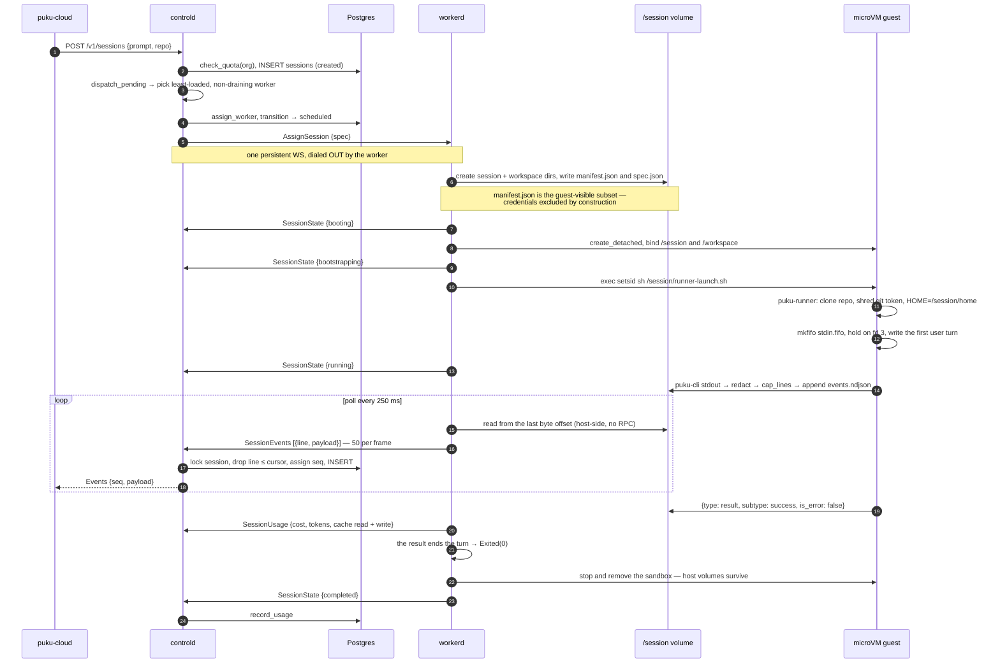
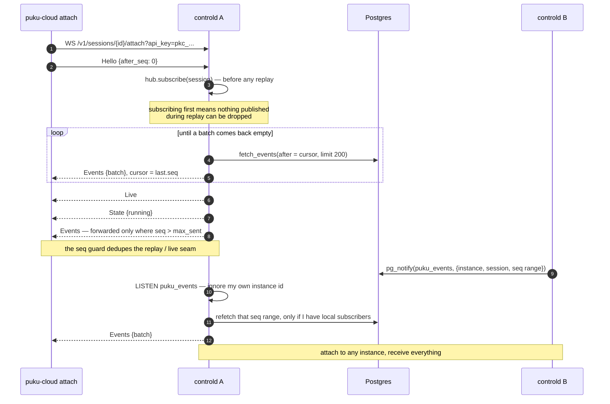
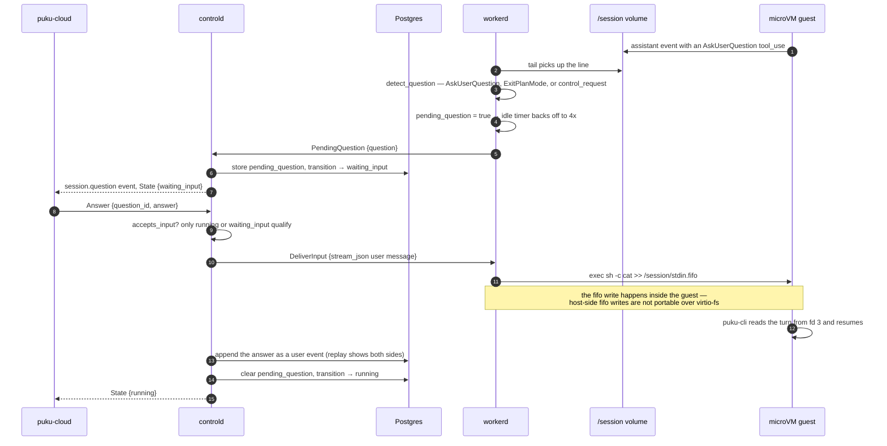
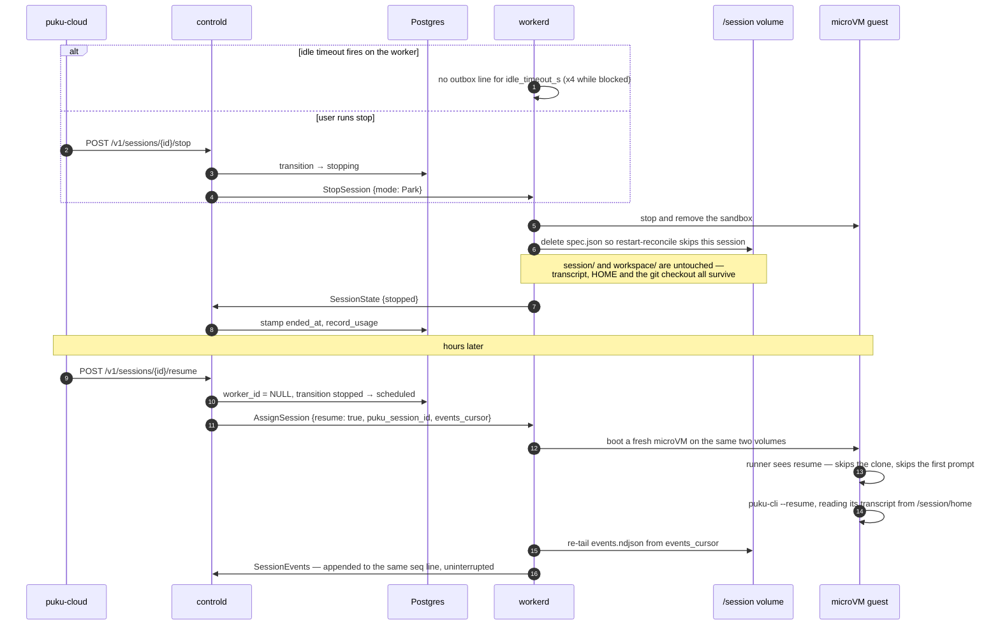
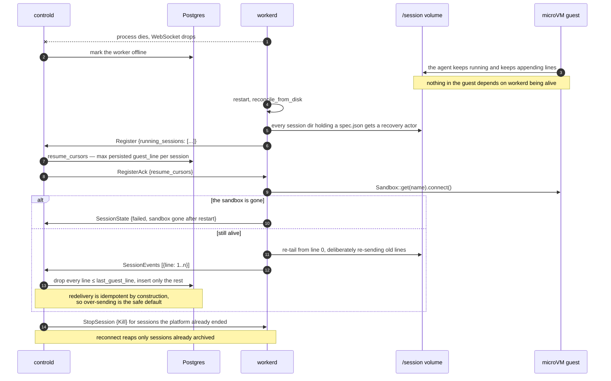

# Session sequence flows

Five flows through puku-agent-cloud. The platform never reimplements the agent: it
runs stock `puku-cli` headless inside a microVM and turns its stdout into a durable,
replayable event stream. Everything below follows from that.

## Cast

| Participant | Where | Role |
| --- | --- | --- |
| `puku-cloud` | client | CLI + dashboard. REST, plus one WebSocket per attached session. |
| `puku-controld` | control plane | REST API, scheduler, client relay, worker link. Allocates every event's global `seq`. |
| Postgres | control plane | Source of truth: sessions, partitioned event log, quotas, audit, NOTIFY bus. |
| `puku-workerd` | worker host | One daemon per Linux/KVM box. One actor + one microVM per session. |
| `/session` | worker host | Host dir bind-mounted into the guest. `events.ndjson`, `stdin.fifo`, durable `HOME`. |
| microVM guest | guest | `puku-runner` supervising `puku-cli -p --output-format stream-json`. |

---

## 1. Cold start: create → boot → stream → complete

- The worker never asks the VM for output. `/session` is a bind mount, so the guest's
  append-only `events.ndjson` is an ordinary file on the host.
- **The `result` line is what ends the turn**, not process exit. puku-cli runs with
  `--input-format stream-json` and stays alive for a follow-up, so waiting for
  `exec.exited` meant waiting for the idle timeout: a session that had succeeded sat
  `running` for 15 minutes and then reported `stopped`. `exec.exited` still arrives when
  the runner does exit, and still ends the session — it is no longer the only way.
- A `result` carrying `is_error: true` fails the session with the agent's own message,
  so an operator sees `API Error: 429 quota_exceeded` rather than an exit code.
- Credentials are filtered out of the manifest before it is written; the runner scrubs
  known secret values out of the stream before it leaves the VM.

---

## 2. Attach: replay from a cursor, then tail live

- `after_seq: 0` replays the whole transcript; `-1` skips to live. The cursor is the
  client's, so detaching costs nothing.
- Persistence always happens before publish, so a lagging subscriber reconciles against
  Postgres instead of losing events.
- Cross-instance fanout carries only a seq range, never a payload — the peer refetches,
  and only if someone is actually watching.

---

## 3. The agent asks a question

- Interrupt takes the same route but ends in a signal: `pkill -INT -f puku-cli` in-guest.
- The user's message is written back into the event log, so replay reproduces the whole
  conversation, not just the agent's half.
- A session waiting on a human idles 4× longer before parking.

---

## 4. Park and resume on the same volumes

- The event log is continuous across a park: resume appends to the same
  `events.ndjson` and the same `seq` sequence, so an attach still replays one story.
- `resume` is derived, not requested — a session that ever reported a
  `puku_session_id` is resumed rather than started.
- **Resume is host-pinned in practice.** The dispatcher clears `worker_id` and re-places
  the session, but the volumes only exist on the original box; cross-worker volume moves
  are not implemented.

---

## 5. The worker daemon dies mid-session

- Worker registration doubles as the crash-recovery handshake: `Register` lists what the
  worker still holds, the ack answers with where to resume.
- The recovered actor ignores those cursors and re-tails from zero, leaning entirely on
  the DB-side drop. Correct, but `RegisterAck.resume_cursors` is currently unused on the
  worker (bound to `_resume_cursors` in `controlplane.rs`).
- Deleting `spec.json` is what ends a session's claim on reconcile.

---

## Why every flow is safe to interrupt anywhere

1. **Total order** — `seq` is allocated under `SELECT … FOR UPDATE` on the session row,
   incremented in the same transaction. One writer per session: no gaps, no ties.
2. **Identity** — a guest line number names the event forever, because `events.ndjson` is
   append-only and never rewritten. Anything at or below the persisted cursor is dropped,
   which is what makes redelivery free.
3. **Durability first** — the broadcast fanout only ever sees committed events, so any
   subscriber can reconcile against Postgres.
4. **No seam** — attach subscribes before replaying, then suppresses anything at or below
   what replay already sent.

Source: `crates/puku-cloud-proto/src/worker_proto.rs`, `crates/puku-controld/src/db/mod.rs`,
`crates/puku-controld/src/api/mod.rs`, `crates/puku-workerd/src/session_actor.rs`,
`images/puku-agent/runner/puku-runner.sh`
